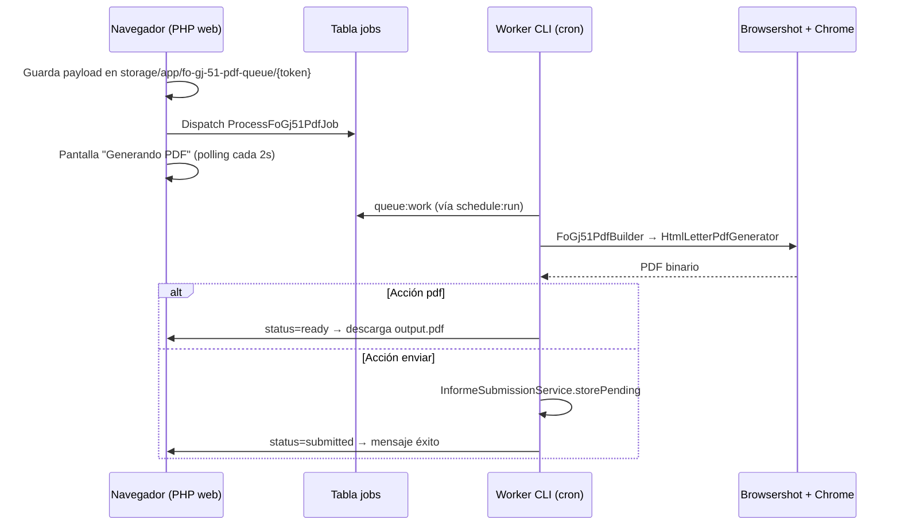

<h1 align="center">SJ LegalSuite</h1>

<p align="center">
  <strong>Plataforma jurídica integral para SJ Seguridad</strong><br>
  Sistema centralizado para administrar todos los procesos del área jurídica con
  control de etapas, trazabilidad legal completa y reportes en tiempo real.
</p>

<p align="center">
  
  
  
  
  
</p>

---

## 📦 Módulos del sistema

SJ LegalSuite está diseñado como una suite de **12 módulos jurídicos**. La construcción
es incremental: el módulo Disciplinario es el núcleo y ya está operativo. Los demás
aparecen en el sidebar como placeholders ("Próx.") hasta que se desarrollen.

| # | Módulo | Estado |
|---|---|---|
| 1 | 🏠 **Inicio** (Command center · solo `admin`) | ✅ Disponible |
| 2 | ⚖️ **Disciplinarios** | ✅ Disponible |
| 3 | 💼 Licitaciones | 🚧 Próximamente |
| 4 | 🛡️ Acciones de tutela | 🚧 Próximamente |
| 5 | 📄 Demandas | 🚧 Próximamente |
| 6 | 👥 Negociación colectiva | 🚧 Próximamente |
| 7 | 🔍 Investigaciones | 🚧 Próximamente |
| 8 | 💰 Cartera | 🚧 Próximamente |
| 9 | 📋 Requisitos legales | 🚧 Próximamente |
| 10 | 📑 Contratos | 🚧 Próximamente |
| 11 | 🛡️ Pólizas | 🚧 Próximamente |
| 12 | 📊 Auditoría | 🚧 Próximamente |

Además del catálogo jurídico, existen en el sidebar:

- **Empleados** (`employees.view` / `employees.manage`): **Empleados SJ** — cockpit con KPIs clicables, tabla compacta sin scroll de página, filas expandibles (chevron), modal de alta/edición por secciones con indicador de **perfil completo** en tiempo real, y carga masiva Excel con progreso por lotes (`EmployeeBulkImportService`, `bulk-import-progress.js`).
- **Usuarios** (`users.view` / `users.manage`): **cockpit** alineado con Empleados — KPIs clicables (Total, Activos, Inactivos, Solo lectura, Admins), tabla expandible, modal por secciones con rol efectivo y búsqueda de ciudades autorizadas; alta/edición, activación y reinicio de contraseña con contraseña provisional generada automáticamente.

Quienes tengan **`settings.manage-territory`**, **`settings.manage-citation-articles`**, **`settings.manage-diligence-questions`** y/o **`settings.manage-supervision-zones`** ven **Ajustes** en el sidebar (sub-nav compartido `components/settings/nav`): **Territorio** (`/settings/territorio`) — cockpit DIVIPOLA; **Artículos** (`/settings/citacion-articulos`) — plantillas FO-GJ-03; **Preguntas** (`/settings/preguntas-diligencia`) — catálogo del cuestionario FO-GJ-04; **Zonas** (`/settings/zonas-supervision`) — catálogo de zonas de supervisión de campo (`SupervisionZonesIndex`).

## ✨ Características principales (módulo Disciplinario)

- **Workflow estricto y validado**: 13 estados, transiciones controladas, plazo de **2 días calendario** para justificar inasistencia a citación (tras constancia).
- **Trazabilidad legal completa**: cada cambio en un caso queda registrado en un audit log inmutable.
- **Roles y permisos granulares** (Spatie Permission v6): paquetes de permisos técnicos (`admin`, `abogado`, `planeacion`, etc.). En negocio, el **área** es el ámbito organizacional (Jurídica, Operaciones…); **dentro del área** el usuario tiene un **cargo** (supervisor, operador, programador…). Cada cargo enlaza a un rol Spatie vía **`job_positions.permission_role_name`** (configurable en **Usuarios → Organización**). El perfil **`admin`** es aparte: «Administrador de la plataforma» en el formulario de usuario. Más el flag **solo lectura** por usuario.
- **Dashboard analítico (cockpit):** vista sin scroll con **7 donas** por etapa A–F (`DisciplinaryDashboardService::build`). **Admin:** alcance global. **Abogado:** solo casos **asignados** (`assigned_lawyer_id`). Mapa Leaflet hero + panel derecho (Top municipios, **catálogo completo de faltas** con micro-barras y ceros, Mi carga / ranking abogados). Sidebar **Disciplinarios** → `disciplinaryPortalUrl()` (dashboard); sub-nav **Disciplinarios** → listado. JS: `disciplinary-dashboard.js`, `disciplinary-colombia-map.js`. Tests: `DisciplinaryDashboardScopeTest.php`.
- **Listado de casos (cockpit operativo):** vista sin scroll de página, **rail de etapas** A–F en una línea (+ **Cerrados** + **Todos**; query `?stage=D` / `cerrados`), filtros compactos y tabla con columna **Etapa**; misma taxonomía que el dashboard (`WorkflowStageBuckets`, `DisciplinaryDashboardService::workflowStageRailCounts`). Alcance `forDisciplinaryActor`. Tests: `DisciplinaryCasesIndexStageTest.php`.
- **Documentos por etapa** con verificación de integridad (SHA-256) y vinculación a formatos oficiales (FO-GJ-XX).
- **Etapa C (diligencia):** registro obligatorio e irreversible **Asistió / No asistió** (`DiligenceAttendance`, `DiligenceAttendanceService`). **Antes de registrar asistencia:** **Reprogramar diligencia** (FO-GJ-54 operativo / fuerza mayor; no marca inasistencia; fechas las fija el abogado o se difieren a planeación; sin límite de veces). **Si asistió:** FO-GJ-04 (modal, vista previa, generación), **firma del trabajador** en pantalla y PDF (`captureFoGj04WorkerSignature`), **Siguiente etapa →** a decisión sin acta + firma (`DisciplinaryDiligenceWorkflowService`). **Si no asistió:** FO-GJ-44 diligenciable y generable (`FoGj44DraftService`, `FoGj44ConstanciaService`) → ventana **2 días** en `JUSTIFICACION_PENDIENTE` → FO-GJ-54 + reprogramación o **acta de comité** (`ComiteActaService`, membrete PNG en Formatos) → **Siguiente etapa →** etapa D tras acta generada. Stepper de 4–6 pasos (`DiligenceStageProgress`). **Captura de firma unificada:** componente `<x-disciplinary.signature-capture-modal>` + `worker-signature-pad.js` (franja horizontal ancho completo, altura fija 17.5rem; móvil táctil, PC mesa digitalizadora Wacom).
- **Etapas A y B (informe + citación):** revisor de operaciones obligatorio al enviar FO-GJ-51; **número de expediente** `GJ-PD:NNNNNN` (consecutivo global en casos nuevos); coordinación explícita con planeación en citación; selección visual de fecha definitiva; **coordinación B (orden actual):** (1) iniciar chat, (2) planeación registra/actualiza **notificación física** (ingreso/turno/zona/supervisor — `canPlanningManageNotification` al abrir coordinación en `CITACION_PROGRAMADA`), (3) **proponer fechas** solo tras notificación completa (`canPlanningProposeDiligenceSlots`), (4) abogado confirma slot, (5) diligenciar FO-GJ-03, (6) evidencia. Barra compacta con **fecha de diligencia** y **datos de notificación**; chat con adjuntos y lightbox. **FO-GJ-03:** modal (`FoGj03DraftService`) con artículos/numerales prellenados desde plantillas por falta (`FoGj03CitationArticleResolver` + Ajustes · Artículos); redacción gramatical por género del empleado (`WorkerLegalPhrasing`); checklist exige género Masculino/Femenino en catálogo; firma del abogado en **Mi perfil**. Avance a diligencia con checklist (`docs/GAP_DISCIPLINARIO_ETAPAS_A_B.md`). **Evidencia de citación:** solo tras generar FO-GJ-03; tipos `signed` o `refused_witnesses`. Pueden cargarla el titular, el **supervisor de notificación**, el revisor del FO-GJ-51, dirección de operaciones y dirección jurídica. El supervisor opera desde **Evidencias pendientes**: PDF escaneado o notificación en pantalla (firma táctil / rechazo con testigos).

### Gestión de usuarios y contraseñas

- **Alta**: contraseña provisional aleatoria; modal único para copiar y enviar por canal seguro; el usuario debe cambiarla en el **primer ingreso** (`must_change_password`).
- **Reinicio por administrador** (icono de llave en listado o detalle): se genera una nueva provisional; **Cancelar** descarta; **Aceptar** persiste el cambio y mantiene la obligación de cambiar contraseña al iniciar sesión.
- **Middleware `must-change-password`**: redirige a `/password/first-login` hasta que el usuario define una contraseña definitiva (compatible con el resto de rutas autenticadas).

## 🖥️ Interfaz de usuario

### Layout global

- **Sidebar lateral fijo** con los 12 módulos del sistema. Los disponibles tienen acceso directo;
  los demás aparecen deshabilitados con badge "Próx." para que el cliente vea el alcance completo
  desde el primer día.
- **Topbar** con acceso a perfil y botón de salir.
- **Sub-nav contextual** por módulo (sticky bajo el topbar).
- **Responsive**: en móvil el sidebar se oculta y se accede con un botón hamburguesa.

### Botones de acción (`sj-btn` / `<x-ui.btn>`)

Los botones de acción del módulo disciplinario comparten altura y tipografía vía clases en `resources/css/app.css` (`.sj-btn`, altura fija `h-8`) y el componente Blade **`components/ui/btn.blade.php`**. Cada variante solo cambia el color (`primary`, `secondary`, `teal`, `ghost`, `dark`, `success`, `danger`, `muted`, `warning`, etc.). El badge de estado (`status-badge`) admite `size="md"` para alinearse con los botones en barras compactas (p. ej. encabezado del detalle del caso). Migración gradual: detalle del caso, listado disciplinario y modal de vista previa de documentos ya usan `<x-ui.btn>`; el resto de vistas pueden adoptarlo sin cambiar la lógica Livewire.

### Tema claro u oscuro

- Cada usuario puede elegir **tema claro** u **oscuro** desde el interruptor en la barra superior (Livewire `ThemeToggle`).
- La preferencia se guarda en la columna **`users.theme`** (`light` | `dark`). Es necesario ejecutar las migraciones (`php artisan migrate`) para crear esa columna.
- El middleware **`ShareUiTheme`** comparte `$uiTheme` con las vistas; el layout aplica la clase `dark` en `<html>` cuando corresponde (Tailwind `darkMode: 'class'`).

Las pantallas principales usan variantes `dark:` para mantener contraste y legibilidad en ambos modos.

### Livewire `wire:navigate`, Vite y consola del navegador

Muchas vistas usan **`wire:navigate`**. Eso evita recargar la página completa, pero el navegador puede mostrar avisos repetidos si los assets no encajan con ese modo.

| Tema | Qué hace el proyecto |
|------|------------------------|
| **Preload de CSS (avisos amarillos)** | Laravel **@vite** inserta `<link rel="preload" as="style">` además del `<link rel="stylesheet">`. Chrome a veces avisa *«preloaded but not used»* al navegar. En **`AppServiceProvider`** se omite el preload **solo para CSS** con `Vite::usePreloadTagAttributes` (los **modulepreload** de JS se mantienen). El callback debe tipar el primer argumento como **`?string $src`**: el framework puede pasar `null` en algunos chunks. |
| **ApexCharts + SVG** | **`resources/js/apex-charts-lifecycle.js`** destruye instancias al salir de la vista (`livewire:navigating` y hook `morph.removing`) para que no queden SVG huérfanos que Livewire intente actualizar (errores de `radialGradient` / `path` en consola). |
| **Mapa Colombia (Leaflet)** | **`resources/js/disciplinary-colombia-map.js`** comprueba que exista `bringToFront` antes de llamarlo (no todas las capas lo exponen en todos los contextos). Modo **`data-compact="1"`** en Inicio: sin scroll con rueda, zoom arriba-derecha; el montaje en **`home-command-center.js`** reutiliza el mismo script que el dashboard disciplinario. Donas del dashboard en **`disciplinary-dashboard.js`**. |
| **Campanita de notificaciones** | Componente **`livewire:ui.notification-bell`**: **`wire:poll.visible.5s`** para no disparar tantas peticiones Livewire con la pestaña en segundo plano. |
| **`APP_KEY` y 500 intermitente** | Si el log muestra `MissingAppKeyException`, **`public/index.php`** intenta cargar de nuevo el `.env` con **Dotenv** cuando `APP_KEY` no está en el entorno antes del bootstrap (útil si el fichero se guarda mientras Apache atiende). Sigue siendo obligatorio tener **`APP_KEY=`** en `.env` y no publicar sin clave. |
| **Pestaña Issues (avisos “verdes”)** | Son sugerencias de **accesibilidad** de Chrome (p. ej. `label` sin `for`, campos sin `id`/`name`). En el **listado de casos disciplinarios**, los filtros enlazan etiqueta y controles con `for` + `id` + `name`. Otras pantallas se pueden alinear con el mismo criterio. |

### Vista de Inicio (Command center)

**Acceso:** solo rol **`admin`** (`User::canViewHomeCommandCenter()`). El resto de perfiles, al abrir `GET /dashboard`, se redirige a su destino operativo (`User::suiteLandingUrl()`: abogado → dashboard disciplinario, supervisor → **portal Supervisión** `/disciplinary/evidences-pending`, etc.). El ítem **Inicio** del sidebar y el logo apuntan a esa URL de aterrizaje.

Vista **sin scroll de página** (`h-[calc(100dvh-…)]`): agregación en **`HomeDashboardService`** (`AlertsService` + `DisciplinaryDashboardService`).

| Zona | Contenido |
|---|---|
| **Cabecera** | Saludo, totales de casos/en proceso/alertas, fecha |
| **4 chips de alerta** | Plazos vencidos, próximos a vencer (≤3 días), sin abogado titular, pendientes de decisión — al pulsar, listado en el panel derecho |
| **Columna izquierda** | Barras **casos por etapa** (A–F) + gráfica de **tendencia** (aperturas 6 meses) |
| **Columna central** | **Mapa Colombia** compacto (~188px) con pins por municipio DIVIPOLA + ranking **Top municipios** (clic centra el mapa) + mini KPIs pendientes / en proceso / finalizados |
| **Columna derecha** | Acceso rápido, detalle de alertas (scroll interno), roadmap de módulos |
| **Fila inferior** | Barras **carga por abogado** (top 5) |

Frontend: **`resources/js/home-command-center.js`** (ApexCharts) monta gráficas y el mapa vía import dinámico de **`disciplinary-colombia-map.js`**. Tests: `tests/Feature/HomeCommandCenterTest.php`.

`AlertsService` sigue siendo el agregador global de alertas y está preparado para sumar módulos futuros.

### Módulo Disciplinario

Sub-nav superior (según permisos y rol): por defecto **Inicio | Dashboard | Disciplinarios | (Revisión informes) | Formatos | Historial**. **Rol `admin`:** **Inicio** → command center (`GET /dashboard`); el módulo **Disciplinarios** en el sidebar → `User::disciplinaryPortalUrl()` (dashboard disciplinario). El enlace *Revisión informes* aparece quienes tienen **`disciplinary.review-inform`** (`InformeSubmissionPolicy::viewAny`). **Rol `abogado`:** `GET /disciplinary` y el ítem **Dashboard** llevan al tablero disciplinario; el ítem **Disciplinarios** del **sub-nav** usa `User::disciplinaryCasesNavUrl()` → **listado** `GET /disciplinary/cases` (el sidebar del módulo también entra por `disciplinaryPortalUrl()` → dashboard). **Rol `planeacion`:** en el sub-nav disciplinario solo **Coordinaciones** (`GET /disciplinary/coordinations`). **Rol `supervisor`:** sidebar/sub-nav **Supervisión** → **portal de campo** (`GET /disciplinary/evidences-pending`, título «Mi trabajo»): CRUD **FO-GJ-51** + bandeja de notificaciones Citación/Decisión; si llega por URL «intended» al dashboard o listado de casos, se redirige al portal (`disciplinaryPortalUrl`). Planeación y supervisor quedan sin acceso al listado/detalle general de expedientes.

| Vista | Contenido |
|---|---|
| **Dashboard** | Vista **cockpit** sin scroll: cabecera contextual por rol (admin global / abogado «Mi tablero» solo casos **asignados**). **7 donas** A–F (misma paleta neon). **Mapa Colombia** hero (~55% ancho) + panel derecho en **3 filas de altura fija**: **Top municipios**, **casos por tipo de falta** (catálogo activo completo con ceros, micro-barras HTML con scroll interno), **Mi carga** (abogado) o mini ranking de abogados (admin). Sin chips de alerta. `DisciplinaryDashboardService::usesAssignedOnlyScope()` para abogado. JS: `disciplinary-dashboard.js` + `disciplinary-colombia-map.js`. Tests: `DisciplinaryDashboardScopeTest.php`. |
| **Disciplinarios** (listado) | Vista **cockpit** sin scroll: cabecera compacta, **rail A–F**, **Cerrados** / **Todos** (Operaciones no ve Cerrados), filtros y tabla con **Etapa**. Alcance `forDisciplinaryActor`. **Operaciones (`nivel2`):** solo casos **abiertos** que **autorizó** (`informeSubmission.reviewed_by`; con `review-inform-all` todos los abiertos); sin Formatos; trámite «En trámite · Etapa X». Tests: `DisciplinaryCasesIndexStageTest`, `DisciplinaryOperacionesCaseScopeTest`. **Coordinaciones** (`planeacion` / `nivel3`): cockpit full-height — bandeja + hilo chat (burbujas), KPIs abiertas/fechas/notif., búsqueda; candidatos a supervisor por `employee.municipality_code` (eager load completo). **Bandeja compartida (INFORME):** claim atómico del abogado. Botones FO-GJ-51 en modal. |
| **Portal supervisor** (`evidences-pending`) | **Hub de campo** (no solo «evidencias»): cockpit sin scroll (`max-w-[1600px]`). Cabecera **Mi trabajo** + zona asignada; bloque **Informes disciplinarios FO-GJ-51** (**Nuevo informe** = digitado Letter; **Cargar PDF** = modal propio, sin digitado detrás); KPIs Citación/Decisión/Zona en `lg+`; rail **Citación / Decisión / Todos**; búsqueda; **bandeja inbox** (tarjetas táctiles en móvil · filas densas en `lg+`, **sin tabla HTML**). Acciones por tarea: **Cargar PDF** y **Ver notificación** (escaneado → carta HTML → firma → preview; lógica Livewire/modales intacta). Empty state alineado al hub. Sidebar/nav: **Supervisión** (`User::minimalDisciplinarySidebarLabel`). Tests: `PendingEvidenceUploadTest`, `SupervisorEvidenceQueueTest`, `DecisionStageCompletionTest`. |
| **Revisión informes** | Cockpit senior (`InformesPendientes`): KPI **Pendientes**, búsqueda densa, filas compactas con `displayName()`, aviso de stale ≥24 h, acciones **Ver** / **Autorizar** / **Rechazar** (modales propios). Cola `InformeSubmission` pendiente: vista previa PDF (`?inline=1`). Revisor asignado con `disciplinary.review-inform`; dirección con `disciplinary.review-inform-all`. Al autorizar se crea el expediente y el PDF entra al caso. Tests: `InformesPendientesUiTest.php`. |
| **Detalle del caso** | **Encabezado compacto**: número de caso; **← Volver al listado**, badge de estado y acciones de Informe si aplican. Tabs: **Gestión** / Línea de tiempo / Documentos / Actuaciones (+ Historial por cédula según rol). **Operaciones (`nivel2`):** sin tabs jurídicos — seguimiento `operaciones-follow-up` («En trámite · Etapa X»). **Pestaña Gestión (jurídico):** ficha (`case-summary-strip`) + **tarjetas A–D** (`CaseStageCardState`). Modal de etapa: `case-stage-modal-shell` + body (`stage-a`…`stage-d`); shell `z-[68]`; modales FO-GJ / decisión en pie a **`z-[85+]`** para no quedar detrás. **FAB «Chat planeación»** → **drawer derecho** (`planning-chat-modal`) con burbujas L/R (`agenda-message` + perspective), composer y lightbox. **Etapa B · evidencia:** dropzone PDF, tipo en cards, **Ver** (preview modal) y **Descargar** por separado. Tests: `CaseDetailStageViewsTest`, `DisciplinaryCitationStageFlowTest`, `DecisionStageFlowTest`, `DisciplinaryOperacionesCaseScopeTest`. Echo `disciplinary.case.{id}`. |
| **Formatos** | Catálogo FO-GJ por etapa A–F; **oculto** para **Operaciones (`nivel2`)** (`viewOfficialForms` denegado) y portales mínimos / nivel3. **Membrete** del acta de comité (PNG/JPEG) vía `OrganizationLetterheadService`. **Plantilla** / **Descarga** de PDFs en blanco (Browsershot Letter para códigos del catálogo HTML). Rutas: `GET …/formats`, `preview/{code}`, `descarga-en-blanco/{code}`, `membrete`. |

**Disciplinario — agenda Etapa B:** `DisciplinaryCase::statusesAllowingAgendaCoordination()` limita el chat abogado ↔ planeación a **citación** y **reprogramación**; `DisciplinaryWorkflowService` no exige respuesta de planeación para pasar de **Informe** a **citación**. Políticas y `DisciplinaryAgendaThreadService` usan `allowsAgendaThread()`.

**Disciplinario — bandeja de abogados (etapa INFORME):** `DisciplinaryCase::scopeInInformePool()` / `isInInformePool()` identifican expedientes en estado **informe** sin titular. El alcance de listados para **abogado** (`forDisciplinaryActor`) une casos propios y pool. Política `claim` autoriza tomar gestión; `view` permite consulta del pool; `update` / `transition` exigen titular asignado. Concurrencia: `claimByLawyer()` actualiza solo si `assigned_lawyer_id` sigue nulo; si falla, `CaseAlreadyClaimedException`. Tests: `tests/Feature/Disciplinary/DisciplinaryLawyerPoolClaimTest.php`.

**Disciplinario — FO-GJ-51 (informe disciplinario):** formulario HTML (`fo-gj-51-informe-body` → `POST disciplinary.forms.informe.process`). Vista `fo-gj-51-preview` + PDF `fo-gj-51-filled-download`. **Pantalla digitada:** el preview interactivo va dentro de `ogj-letter-screen-sheet` (hoja Letter 8.5×11″ centrada, zoom/pan Alpine `fo51-letter-zoom.js` en modales; ver `docs/PDF.md` §8). Clase `fo51-interactive` — flex en grilla personal y faltas (navegador). **PDF Dompdf:** `renderAsPdf` + clase `fo51-pdf` — sin flex (`display: table` en datos del trabajador), faltas con mini-tabla `fo51-fault-line-tbl` (casilla al final), observaciones en `div.fo51-obs-pdf` (no `textarea`); objetivo **1 hoja Letter**. **Grilla datos del trabajador** (tabla de 4 columnas, etiqueta inline en mayúsculas): fila 1 **CC:** (25%) + **NOMBRE:** (`colspan="3"`, 75%); fila 2 **CARGO:** | **CIUDAD:** | **TURNO:** | **PUESTO:** (25% c/u). En móvil, `fo-gj-51-screen-mobile` no apila la Letter por defecto (`fo51-stack-on-narrow` solo si se pide). Acciones digitadas: **Generar PDF**, **Enviar a revisión** (revisor operaciones + firma elaborador obligatorios). **Cargar PDF externo** (`fo51_action=cargar`): modal standalone `fo-gj-51-pdf-upload-modal` (Livewire `showFo51PdfUploadModal` / `openFo51Modal(true)` — **sin** hoja digitada detrás). Flujo UI: (1) dropzone PDF (clic / arrastrar / pegar) + **vista previa con scroll real vía PDF.js** (`pdfjs-dist`, chunk `fo51-pdfjs-scroll-viewer` + worker en `public/build`; no usa Dompdf/Browsershot ni el plugin PDF del navegador); (2) trabajador (lookup CC); (3) metadatos; (4) faltas por panel multi-checkbox + **Guardar** + Otros fijo; (5) evidencias ≤10; (6) revisor. Backend: `uploadToRevisionQueue` guarda PDF + `evidence_images` + snapshot (`fo51_fault_*`, municipio, fecha, etc.). **Sin** `fo51_preparer_signature` en `cargar`. Validación fallida `nivel7` → `evidences-pending?cargar_pdf=1`. **Evidencias** en digitado: modal tiles (`fo51-evidence-tiles.js`). **Supervisor:** hub o `GET …/informe-fo-gj-51?vista_completa=1`; `FoGj51ProcessRequest` redirige al hub/formulario según rol (evita 403 en listado). Nombre/cargo elaborador desde sesión; firma solo en `pdf`/`enviar` (`PngSignatureDataUri`). **Hosting:** tras deploy, `npm run build` (o CI) debe publicar chunk PDF.js + `pdf.worker*.mjs` en `public/build`. Con `PDF_USE_QUEUE=true`, **Generar PDF** / **Enviar** digitados encolan `ProcessFoGj51PdfJob`; **Cargar PDF** sigue síncrono. Tests: `FoGj51PreparerSignatureTest.php`, `SupervisorEvidenceQueueTest.php`. Doc técnica: `docs/PDF.md` §8 y §8.1.

**Disciplinario — Etapa B (citación):** chat libre abogado ↔ planeación (`AgendaMessageKind::GENERAL`) en **drawer derecho** «Chat planeación» (FAB). Adjuntos con lightbox. Stepper `CitationStageProgress`: coordinación → **notificación física** → fechas propuestas → fecha definitiva → FO-GJ-03 → evidencia. Orden operativo: (1) iniciar coordinación, (2) en Coordinaciones **Registrar/actualizar notificación y supervisor** (`canPlanningManageNotification` / `canPlanningManageCitationCoordination`), (3) **Proponer fechas** solo si la notificación está completa (`canPlanningProposeDiligenceSlots`), (4) abogado confirma slot, (5) diligenciar FO-GJ-03 (artículos desde plantilla de falta), (6) evidencia. Migraciones: `2026_06_03_120000_…`, `2026_06_04_100000_…`, `2026_08_11_100000_create_citation_statute_tables.php`. Tests: `DisciplinaryCitationStageFlowTest`, `DisciplinaryCitationNotificationTest`, `FoGj03DraftTest`, `FoGj03CitationArticleResolverTest`, `DisciplinaryCoordinationsIndexTest`, `DisciplinaryOperacionesCaseScopeTest`.

**Disciplinario — portal Operaciones (`nivel2`):** tras autorizar FO-GJ-51, listado y detalle reducidos: solo casos **abiertos** con `reviewed_by` = usuario (o todos abiertos con `review-inform-all`); sin Formatos; ficha `operaciones-follow-up` («En trámite · Etapa X»). Visibilidad: `scopeVisibleToOperacionesReviewer` / `isVisibleToOperacionesReviewer`. Tests: `DisciplinaryOperacionesCaseScopeTest.php`.

**Disciplinario — FO-GJ-03 (citación por escrito):** plantilla `fo-gj-03-body.blade.php` + parciales `fo-gj-03-opening` / `charges` / `articles` / `evidence` / `closing-signatures` + `FoGj03DraftService` + **`FoGj03DocumentPaginator`** (páginas Letter explícitas; cuerpo continuo; **único bloque atómico: firmas**). Forma canónica en **1** Letter; párrafos justificados. **Artículos/numerales:** catálogo `citation_statute_*` + plantillas por falta (`fault_citation_templates*`); resolución en `FoGj03CitationArticleResolver` — una falta → bloques con numerales de la plantilla; varias faltas → unión de artículos **sin** numerales (el abogado completa). Seed: `CitationFaultTemplatesSeeder` (F-001…F-010). UI de mantenimiento: **Ajustes · Artículos** (`CitationArticlesIndex`, `CitationFaultTemplateService`). **Redacción por género:** `WorkerLegalPhrasing` (saludo, verbos, traslado, FO-GJ-04/54); checklist de generación exige género definido en `employees.gender`. Campos automáticos: fecha del documento, trabajador, diligencia confirmada, fecha del informe. Modal: hora, presencial/virtual, incumplimiento, hechos, bloques artículo+numerales editables. Firma del abogado en **Mi perfil**. PDF firmado en pantalla: `fo-gj-03-signed-notification-download` + `CitationNotificationSigningService`. Tests: `FoGj03DocumentPaginatorTest`, `FoGj03CitationArticleResolverTest`, `WorkerLegalPhrasingTest`, `OfficialLetterPdfLayoutTest`, `CitationArticlesIndexTest`.

**Disciplinario — FO-GJ-04 (acta de diligencia):** sustituye **FO-GJ-42** en catálogo y código (`OfficialFormsCatalog`, sin alias). Plantilla multipágina `fo-gj-04-body.blade.php` / `fo-gj-04-filled-download` con parciales `fo-gj-04-intro`, `fo-gj-04-question-item`, `fo-gj-04-closing-signatures`. **Fecha del incumplimiento** y **formulación de cargos** desde FO-GJ-03. Diligenciamiento: `FoGj04DraftService`; cuestionario `{ question, answer, source, catalog_question_id }` — seleccionar del **catálogo** (texto bloqueado), **personalizada** (solo esa acta) y reorden ↑↓; texto **congelado** en payload. Catálogo: **Ajustes · Preguntas** (`DiligenceQuestionsIndex`, `settings.manage-diligence-questions`, `diligence_acta_questions`, seed `DiligenceActaQuestionsSeeder`). Generación: `FoGj04DiligenceActaService` + `FoGj04PagePlanner` → `DocumentType::ACTA_DILIGENCIA`. Vías de firma: generar en sistema o cargar PDF escaneado. Tests: `FoGj04DraftTest.php`, `DiligenceQuestionsIndexTest.php`.

**Disciplinario — Etapa C (Fases 1–3 implementadas):** al abrir la gestión el día de la diligencia, el **primer paso** es registrar **Asistió** o **No asistió**, o bien **Reprogramar diligencia** (FO-GJ-54 operativo) si aún no hay asistencia. **Si asistió:** FO-GJ-04 + firma del trabajador + **Siguiente etapa →** a `DECISION` (`DisciplinaryDiligenceWorkflowService`). **Si no asistió:** **FO-GJ-44** (`FoGj44DraftService`, `FoGj44ConstanciaService`, `DocumentType::CONSTANCIA_INASISTENCIA`) → transición automática a **JUSTIFICACION_PENDIENTE** (2 días) → **FO-GJ-54** + `acceptJustification` o `rejectJustification` → **Comité disciplinario** (`COMITE_DISCIPLINARIO`) → acta de comité + **Siguiente etapa →** a `DECISION`. **Reprogramación operativa (fuerza mayor, antes de registrar asistencia):** FO-GJ-03 y su evidencia **se conservan** (citación única). Flujo: `FoGj54DraftService::MODE_OPERATIONAL` → generar FO-GJ-54 (`generateOperationalRescheduleAndStore`) → `DILIGENCIA` → `REPROGRAMADO` → cargar evidencia de recibido (`uploadReceiptEvidenceAndReturnToDiligence`) → `DILIGENCIA`. Fechas: abogado en el modal **o** diferir a planeación (`beginOperationalRescheduleWithPlanning`, limpia solo `citation_confirmed_*` y reabre chat). Rutas PDF: `fo-gj-44/pdf`, `fo-gj-54/pdf`, `comite-acta/pdf`. Tests: `DiligenceOperationalRescheduleTest.php`. **Fase 4 (futuro):** FO-GJ-55 + acta de ampliación.

**Disciplinario — Comité disciplinario (acta):** estado `COMITE_DISCIPLINARIO` tras rechazo o vencimiento de justificación. En detalle del caso: **tarjeta C activa** → modal **Etapa C · Comité** (stepper **6 pasos**: asistencia → diligencia → constancia → justificación → acta de comité → comunicado de decisión); `CaseOverviewStageStack` legacy **solo C + A** (sin B en pila). Barra de acciones: **Diligenciar comité** → **Vista previa PDF** → **Generar y guardar** (+ **Consultar FO-GJ-44** opcional); tras acta en expediente, **Siguiente etapa →** con modal de confirmación → transición a **`DECISION`** (etapa D; `TransitionMap` + `DisciplinaryDiligenceWorkflowService::assertCanAdvanceToDecision`). Modal comité: decisión/acuerdo, integrantes (nombre, cargo, firma capturable). Servicios: `ComiteDraftService`, `ComiteActaService` → parciales `comite-acta-pdf-styles`, `comite-acta-pdf-document`, `comite-acta-body` + **Browsershot** (`DocumentType::ACTA_COMITE`). Maquetación: **Times New Roman 12 pt** (firmas 11 pt), interlineado **1.0**, espaciado entre bloques (fecha → empresa → ACTA/CASO/ASUNTO → **Decisión / acuerdo del comité:** → relato → integrantes). Con **membrete** cargado en Formatos: imagen PNG/JPEG a sangre (8.5×11″, `@page margin: 0`, padding superior ~1.35″, `HtmlLetterPdfGenerator` con márgenes cero), firmas en **2 columnas** (Firma / Nombre / Cargo). Sin membrete: encabezado estándar `official-letter-pdf-shell`. **Catálogo Formatos:** código **ACTA-COMITE** — plantilla en blanco (`comite-acta-blank-download`) con vista previa modal y descarga (`OfficialFormHtmlBlankPdfFactory` incluye membrete si está configurado). Migración `2026_06_18_100000_diligence_justification_and_comite` (`comite_payload`, `comite_generated_at`, etc.). Políticas: `editComiteDraft`, `previewComite`, `generateComite`. Tests: `CaseDetailStageViewsTest` (comité + avance a decisión), `OrganizationLetterheadTest` (membrete + ACTA-COMITE en catálogo).

**Disciplinario — Membrete acta de comité (Formatos):** tarjeta **Membrete · Acta de comité disciplinario** en `GET /disciplinary/formats`. Carga **PNG/JPEG** (máx. 8 MB) vía `OrganizationLetterheadService` → `storage/app/disciplinary/letterhead/`. Vista previa: `GET /disciplinary/formats/membrete`. Permiso `manageOfficialLetterhead` (`admin` o `disciplinary.assign`). En desarrollo, `DISCIPLINARY_COMITE_BYPASS_DEADLINE=true` en `.env` omite los 2 días antes del botón Comité (`config/disciplinary.php`).

**Disciplinario — Etapa D (comunicado de decisión):** **tarjeta D** → modal **Etapa D · Comunicado de decisión**. Stepper `DecisionStageProgress` (5 pasos: tipo → programación → documento FO-GJ → entrega → cierre con conclusión). **Ramas** (`DecisionBranch`): **suspensión** (`SUSPENSION` → **FO-GJ-47**), **llamado de atención** (`AMONESTACION_ESCRITA` → **FO-GJ-46**), **terminación** (`TERMINACION_CONTRATO` → **FO-GJ-45**). **Programación (todas las ramas):** planeación publica **varias opciones** (fecha, hora, turno, zona, supervisor; en suspensión también `suspension_start`); el abogado **confirma una** (`DecisionCoordinationService::confirmOption`) o **solicita otras fechas**; republicar invalida la confirmación (y el PDF generado si existía, sin tocar evidencia/paquete ya cargados). Ya **no** hay segundo modal «Notificación de decisión». Flujo: (1) tipo; (2) opciones + confirmación; (3) borrador FO-GJ + PDF; (4) **46/47** evidencia supervisor / **45** paquete PDF abogado; (5) conclusión → `FINALIZADO`. Tests: `DecisionCoordinationTest.php`, `DecisionStageFlowTest.php`, `DecisionStageCompletionTest.php`, `FoGj45/46/47DraftTest.php`.

**Disciplinario — FO-GJ-45 (acta de archivo):** solo rama `TERMINATION` / `TERMINACION_CONTRATO`. Plantillas `fo-gj-45-body` + filled/blank/signed-notification. Abogado digita el **párrafo completo** (incluye fecha del informe, relato y *esta Dirección ha RESUELTO:*), resolutivos **PRIMERO** / **SEGUNDO** (precarga: terminar contrato / archivar) y firmante GH. Tras generar el PDF, el titular carga el **paquete PDF de anexos** (certificado laboral, egreso, SS, liquidación, etc.). Sistema: datos del trabajador, saludo por género (`foGj45OpeningSalutation`), cierres fijos y firmas (*Cordialmente,* + *El/La trabajador(a);* vía `foGj45WorkerSignatureLead`). Generación vía `DecisionComunicadoService`. Tests: `FoGj45DraftTest.php`. Catálogo Formatos: **FO-GJ-45**.

**Disciplinario — FO-GJ-46 (llamado de atención):** solo rama `NOTICE` / `AMONESTACION_ESCRITA`. Plantillas `fo-gj-46-body` + filled/blank/signed-notification. Abogado elige apertura (`FoGj46HearingLead`: *surtida* / *citado*); si **citado**, puente de inasistencia antes del análisis; sistema completa modalidad y fechas desde FO-GJ-03/citación; libre: relato tras incumplimiento, **artículos/numerales del FO-GJ-03** (`DecisionStatuteArticles`: `statute_articles` / claves legacy `article_*_numerals`; UI dinámica, no fija 55/57/60), firmante. Concordancia de género (`WorkerLegalPhrasing`). Generación vía `DecisionComunicadoService`. Catálogo Formatos: **FO-GJ-46**.

**Disciplinario — FO-GJ-47 (suspensión):** solo rama `SUSPENSION`. Plantillas `fo-gj-47-body` (2 páginas: cuerpo + firmas) + filled/blank/signed. Abogado: párrafo introductorio, **días** (1–90), **artículos/numerales del FO-GJ-03** (`DecisionStatuteArticles`, misma precarga que FO-GJ-46), nombre/cargo firmante Gestión Humana. Planeación: **fecha de inicio** en la opción de coordinación (fin y retorno los calcula `SuspensionPeriodCalculator`, días calendario). Textos fijos oficiales: *RESOLVIÓ*, efectos de suspensión, análisis de hechos, cierre y recurso de apelación (2 días hábiles). Género en saludo y “trabajador/trabajadora”. Tests: `FoGj47DraftTest.php`, `DecisionStatuteArticlesTest.php`.

**Disciplinario — Captura de firma (móvil y mesa digitalizadora):** lienzo **`worker-signature-pad.js`** con franja horizontal centrada (ancho `calc(100vw - margen)`, altura fija **17.5rem**). En móvil: dedo (`pointer`/`touch`). En PC: lápiz Wacom vía Pointer Events (mapear la mesa a **un solo monitor** y maximizar el navegador). **Livewire:** `<x-disciplinary.signature-capture-modal>` en FO-GJ-03, FO-GJ-45, FO-GJ-46 y FO-GJ-47 (supervisor: trabajador y testigos) y FO-GJ-04 (trabajador en acta). **Formularios POST (Alpine):** `<x-disciplinary.signature-capture-modal-alpine>` + `sjFo51PreparerSignature()` en **FO-GJ-51** (firma de quien elabora el informe). Validación backend: regla `PngSignatureDataUri`.

**Disciplinario — coordinaciones con planeación:** `Coordinations\Index`: en citación, **Registrar/actualizar notificación** (`lugar` + **zona de supervisión** + turno/fecha); **Proponer fechas** tras notificación completa. En decisión: opciones con lugar + zona de supervisión; abogado confirma una. Tests: `DisciplinaryCoordinationsIndexTest`, `DecisionCoordinationTest`.

**Disciplinario — composer y adjuntos de agenda (front):** `resources/js/disciplinary-agenda-composer.js` (clip, paste, drag-drop, `$uploadMultiple` Livewire); componentes Blade `agenda-chat-composer`, `agenda-attachment-lightbox-modal`; props Livewire `agendaLawyerUploads` / `agendaPlanningUploads`. Previews pendientes y mensajes publicados abren el mismo modal (imagen con zoom; PDF en iframe).

**Disciplinario — evidencia de citación:** `canReceiveCitationEvidence()` exige FO-GJ-03 generado y documento asociado. Carga vía `uploadCitationEvidence` (PDF escaneado) o notificación firmada en pantalla. Matriz en `canUserUploadCitationEvidence()`: titular, revisor FO-GJ-51, `review-inform-all`, **miembros de la zona de supervisión** (`notification_supervision_zone_id`), dirección jurídica. Cola `evidences-pending` por membresía de zona. Tests: `DisciplinaryCitationNotificationTest.php`, `PendingEvidenceUploadTest.php`, `SupervisorEvidenceQueueTest.php`.

**Disciplinario — evidencia de decisión:** `canReceiveDecisionEvidence()` exige comunicado generado (`decision_comunicado_generated_at` o documento FO-GJ-45 / FO-GJ-46 / FO-GJ-47 en expediente). Carga vía `uploadDecisionEvidence` (PDF) o notificación firmada (`PendingEvidenceIndex::buildSignedNotificationPackage` → FO-GJ-45, FO-GJ-46 o FO-GJ-47 según decisión). En **terminación**, el cierre exige el **paquete PDF del abogado** (no la cola RRHH). Matriz en `canUserUploadDecisionEvidence()`. Tests: `DecisionStageCompletionTest.php`, `PendingEvidenceUploadTest.php`.

### Módulo Empleados

Ruta: **`GET /employees`** · permisos `employees.view` / `employees.manage`

| Vista / acción | Contenido |
|---|---|
| **Listado (cockpit)** | Vista sin scroll de página: header **Empleados SJ** + acciones compactas. **5 KPIs clicables** (Total, Activos, Incompletos, Operativos, Administrativos) con filtros en URL. Toolbar integrado: búsqueda, pills `Todos\|Activos\|Inactivos\|Incompletos`, filtros por **rol** y **contrato**, paginación **20/50/100**. Tabla compacta (~36px): chevron ▼ (solo el chevron expande; una fila a la vez) + empleado en una línea + **cargo** + estado; detalle expandido: territorio, contrato, rol, contacto, **Editar**. Vista móvil en tarjetas con la misma lógica. Nombres en formato legible (`Employee::displayName()`). Incompletos: borde ámbar izquierdo (`isProfileComplete()` exige cargo, contrato, ingreso y territorio residencia/labor; **no** pide fecha de terminación). |
| **Crear / Editar** | Modal en 4 bloques con header/footer sticky: datos personales, contacto y territorio (DIVIPOLA), laboral (rol primero → cargo filtrado del catálogo, aviso guardas), emergencias. Banner **perfil completo / incompleto** en vivo (`Employee::profileCompletionIssues()`). Contactos `S/I`, `NN`, `NA`, `NO` se normalizan como en Excel (`EmployeeImportValueNormalizer`). Rol empleado = columna Excel «Área o departamento». |
| **Carga masiva** | Excel `.xlsx` fila 1 = encabezados; plantilla **`GET /employees/plantilla`**. Columnas: nombre, documento, fechas, género, dirección, territorios (municipio o departamento), contactos (`S/I`, `NN`, `NA`, `NO`), contrato, cargo, rol, salario, contacto emergencia, **Empleado activo** (opcional). Import por lotes con progreso animado en UI (`EmployeeBulkImportStore`, polling Livewire, `bulk-import-progress.js`; `BATCH_SIZE=12`). |
| **API búsqueda** | `GET /api/employees/search?q=` — autocompletado FO-GJ-51 y otros consumidores |

**Catálogo de cargos:** tabla `employee_job_positions` (57 cargos, flag `is_guarda`, `employee_scope` operativo/administrativo). Gestión en **Usuarios → Organización**. Roles de plataforma **`nivel1`–`nivel9`** (Spatie) sustituyen el modelo anterior de roles nominales en permisos de empleados/usuarios.

Los expedientes disciplinarios referencian **`employee_id`**. Resolver: `App\Services\Employees\EmployeeResolver` · territorio en import: `EmployeeTerritoryResolver`.

> Tras cambios de esquema o permisos, en desarrollo conviene **`php artisan migrate:fresh --seed`**. Tras actualizar permisos en producción: **`php artisan permission:cache-reset`**.

### Módulo Ajustes

Sub-nav (`components/settings/nav`): **Territorio** | **Artículos** | **Preguntas** | **Zonas** (según permisos). Redirect `GET /settings` → territorio.

#### Territorio (DIVIPOLA)

Ruta: **`GET /settings/territorio`** · permiso `settings.manage-territory`

| Vista / acción | Contenido |
|---|---|
| **Cockpit** | Layout sin scroll: **4 KPIs** (municipios, departamentos, con coordenadas, última actualización vía `max(updated_at)`). Grid 4+8: panel izquierdo importación, panel derecho explorador. |
| **Importación** | Dropzone drag & drop (`.xlsx` / `.csv UTF-8`, máx. 15 MB). Hoja Excel **Municipios**, datos desde **fila 3**, columnas **A–H**. Upsert por código municipio 5 dígitos (`ColombianMunicipalityImportService`). Tarjeta de resultado inline (nuevos / actualizados). Acordeón con tabla de columnas. |
| **Explorador** | Búsqueda live (municipio, departamento, código), filtro por departamento, paginación 50/100, tabla compacta con indicador de coordenadas. |

Tests: `TerritoryImportTest.php` · modelo: `ColombianMunicipality` (`scopeSearch`, `hasCoordinates()`).

#### Citación · Artículos (plantillas FO-GJ-03)

Ruta: **`GET /settings/citacion-articulos`** · permiso `settings.manage-citation-articles`

| Vista / acción | Contenido |
|---|---|
| **Listado** | Catálogo de faltas activas con resumen de artículos/numerales configurados (`CitationFaultTemplateService::faultsWithTemplateSummary`). |
| **Gestionar** | Modal por falta: filas artículo + numerales (CSV). Persiste `fault_citation_templates` + pivotes a `citation_statute_articles` / `citation_statute_numerals`. Vaciar bloques = limpia plantilla. |
| **Uso en FO-GJ-03** | `FoGj03CitationArticleResolver` prellena el modal de diligenciamiento según faltas del expediente. |

Migración: `2026_08_11_100000_create_citation_statute_tables.php`. Seed: `CitationFaultTemplatesSeeder` (vía `DatabaseSeeder`). Tests: `CitationArticlesIndexTest.php`, `FoGj03CitationArticleResolverTest.php`.

#### Preguntas · Acta FO-GJ-04

Ruta: **`GET /settings/preguntas-diligencia`** · permiso `settings.manage-diligence-questions`

| Vista / acción | Contenido |
|---|---|
| **Listado** | Catálogo activo/inactivo de preguntas del cuestionario FO-GJ-04 (`DiligenceActaQuestionCatalogService`). |
| **Gestionar** | Alta/edición/reorden; texto usado al seleccionar en el modal de acta (se congela en el cuestionario del FO-GJ-04). |

Migración: `2026_08_12_100000_create_diligence_acta_questions_table.php` + permiso `2026_08_12_100100_add_manage_diligence_questions_permission.php`. Seed: `DiligenceActaQuestionsSeeder`. Tests: `DiligenceQuestionsIndexTest.php`.

#### Zonas de supervisión (campo)

Ruta: **`GET /settings/zonas-supervision`** · permiso `settings.manage-supervision-zones` · Livewire `SupervisionZonesIndex` + `SupervisionZoneService`.

| Vista | Contenido |
|---|---|
| **Listado / CRUD** | Catálogo `supervision_zones` (nombre, código, email de notificación corporativa, activo, orden). Alta/edición/baja con validaciones (no borrar si hay casos o miembros). |
| **Asignación** | Los supervisores (`nivel7`) se vinculan a **una zona** en **Usuarios → crear/editar** (pivot `supervision_zone_user`). La cola de notificaciones y las policies de evidencia usan **membresía de zona**, no un FK a persona. |
| **Lugar vs zona** | **Zona de supervisión** = ámbito operativo del equipo. **Lugar** (`notification_zone` / `decision_notification_zone`) = texto del sitio físico del turno en la notificación. |

Migración: `2026_08_13_100000_create_supervision_zones_and_reassign_notifications.php` (MySQL: quita FKs legacy a supervisor persona; SQLite en tests las conserva). Redirect legacy `/users/zonas-supervision` → settings. Seed demo: zona + supervisor en `DemoUsersSeeder`.

### Módulo Usuarios

Sub-nav: **Inicio | Usuarios | Organización**

Ruta listado: **`GET /users`** · permisos `users.view` / `users.manage`

| Vista | Contenido |
|---|---|
| **Usuarios** (cockpit) | Vista sin scroll (respeta sub-nav): header **Usuarios** + Organización + Nuevo usuario. **5 KPIs clicables** (Total, Activos, Inactivos, Solo lectura, Admins) con filtros en URL (`q`, `role`, `area`, `estado`, `acceso`, `pp`). Toolbar: búsqueda, pills `Todos\|Activos\|Inactivos`, filtro **nivel** y **área**, paginación **20/50/100**. Tabla compacta con chevron ▼ (una fila expandida): usuario (avatar `User::initials()`, email), área/cargo (`cargoDisplayLabel()`, badge *Admin plataforma*), acceso (activo + solo lectura). Detalle expandido: documento, casos asignados/reportados, ciudades autorizadas, enlace a ficha y acciones (editar, contraseña, activar, eliminar). Skeleton + `wire:loading` al filtrar. |
| **Crear / Editar** | Modal por secciones: identidad, organización (área → cargo, admin plataforma), **zona de supervisión** (obligatoria de negocio para `nivel7` / cargo supervisor), alcance territorial (nivel7/8 con búsqueda DIVIPOLA), permisos directos Operaciones, acceso (cambios / activo). Banner con **rol efectivo** y conteo de ciudades. Al editar se cargan correctamente `is_active` y `read_only`. Mapa legacy `supervisor` → `nivel7` al guardar roles Spatie. |
| **Organización** | Catálogo de **áreas** activas y **cargos** por área; cada cargo define el **perfil de permisos (Spatie)** que recibirán los usuarios asignados a ese cargo (`permission_role_name`) |
| **Detalle** | Datos del usuario, casos disciplinarios asignados, mismas acciones administrativas permitidas por política |
| **Mi perfil** (`GET /profile`) | Datos de cuenta, contraseña y **firma digital** (imagen PNG/JPG/WebP; solo el usuario dueño; usada en FO-GJ-03 y documentos que requieran firma del titular) |

En **crear/editar usuario**: **Área** + **Cargo** (obligatorios salvo «Administrador de la plataforma»); checkbox para **`admin`** (nivel1) desactiva área/cargo en pantalla. Los permisos directos extra para **Operaciones** (FO-GJ-51, notificaciones, PDF) siguen como toggles cuando el ámbito es Operaciones.

Tests: `UsersIndexTest.php`, `EmployeesIndexFormTest.php`.

## 🏛️ Workflow del proceso disciplinario

Etapas normativas SJ (referencia):

| Etapa | Contenido |
| --- | --- |
| **A** | Falta e informe disciplinario — **FO-GJ-51**. La coordinación de fechas con planeación (**FO-GJ-03**, chat e imágenes) corresponde a la **Etapa B** (citación / reprogramación), no al estado Informe. |
| **B** | Citación a diligencia disciplinaria por escrito — **FO-GJ-03**. Si no asiste: **FO-GJ-44** (constancia de inasistencia) y **2 días calendario** para justificar; si justifica → reprogramación (**FO-GJ-54**); si no → comité disciplinario para decisión |
| **C** | Diligencia disciplinaria y acta — **FO-GJ-04** |
| **D** | Comunicado de la decisión de sanción o cierre del proceso |
| **E** | Recurso de apelación contra la decisión disciplinaria |
| **F** | Decisión de segunda instancia |

```
BORRADOR
   ↓
INFORME (FO-GJ-51) ────────────────► ARCHIVADO
   ↓
CITACION_PROGRAMADA (FO-GJ-03) ─┐
   │   │   │                    │
   │   │   └─► CITACION_NO_ASISTIO (FO-GJ-44)
   │   │             ↓
   │   │      JUSTIFICACION_PENDIENTE (deadline 2 días calendario)
   │   │           │            │
   │   │           ↓            ↓
   │   └──► REPROGRAMADO (FO-GJ-54)   COMITE_DISCIPLINARIO
   │           │                      │
   ↓           ↓                      ↓
   ↓           ↓                      ↓
DILIGENCIA (FO-GJ-04) ◄──────────────┘
   │     │
   │     └──► JUSTIFICACION_PENDIENTE (inasistencia en diligencia)
   │                    │
   │                    ├──► REPROGRAMADO (FO-GJ-54)
   │                    └──► COMITE_DISCIPLINARIO
   ↓
DECISION (comunicado sanción / cierre; rama asistió)
         │  │
         │  └──► APELACION ──► SEGUNDA_INSTANCIA
         ↓                            │
      FINALIZADO ──────────► ARCHIVADO
```

Toda transición pasa por `DisciplinaryWorkflowService::transition()` que garantiza atómicamente:

1. La transición está permitida (`TransitionMap`).
2. Se crea automáticamente la etapa correspondiente.
3. Se registra la actuación en el audit log.
4. Se actualiza el estado denormalizado en la tabla `disciplinary_cases`.

## 🛠️ Stack técnico

- **Backend**: Laravel 12, PHP 8.2+, MySQL 8
- **Autorización**: Spatie Laravel Permission v6
- **Frontend**: Livewire 3, Alpine.js, Tailwind CSS, ApexCharts (global vía Vite), Leaflet (mapa Colombia en dashboard disciplinario)
- **Broadcasting**: [Pusher Channels](https://pusher.com/channels) + Laravel Echo (`resources/js/echo-notification-bell.js`); `BROADCAST_CONNECTION=pusher` y credenciales `PUSHER_*` en `.env` para campanita y canales privados de agenda (sin servidor WebSocket propio en Laragon).
- **PDF desde HTML**: Spatie Browsershot + Puppeteer (salida **Letter**); el paquete `barryvdh/laravel-dompdf` permanece disponible para otros usos si se requiere.
- **Auth**: Laravel Breeze (stack Livewire)
- **Servidor**: Apache (Laragon en desarrollo)

## 📁 Estructura del proyecto

```
app/
  Enums/
    UserArea.php
    Disciplinary/              Enums del dominio disciplinario
  Exceptions/Disciplinary/     InvalidStateTransitionException
  Workflow/Disciplinary/       TransitionMap (única fuente de verdad)
    Support/
    Disciplinary/              OfficialFormsCatalog, WorkflowStageBuckets, FoGj03DocumentPaginator, FoGj04PagePlanner, **WorkerLegalPhrasing** (redacción por género FO-GJ-03/04/54), CitationStageProgress, …
    Employees/                 EmployeeBulkImportStore (sesión progreso carga masiva)
    Broadcasting/              PusherBroadcasting (Echo solo si `BROADCAST_CONNECTION=pusher` y credenciales completas)
    Notifications/             Trait BroadcastsInAppDatabaseNotification (canal `broadcast` además de `database` cuando Pusher está activo)
    Pdf/
      HtmlLetterPdfGenerator.php Fachada HTML → Letter (`PDF_DRIVER`)
      LetterPdfDriver.php         Selector browsershot|dompdf + shouldUseQueue()
      DompdfLetterPdfDriver.php   Motor PHP puro (Hostinger inmediato)
      FoGj51PdfQueueStore.php     Cola FO-GJ-51 (solo browsershot + USE_QUEUE)
      FoGj03PdfQueueStore.php     Cola FO-GJ-03 (solo browsershot + USE_QUEUE)
      BrowsershotBinaryResolver.php Detección Node/npm/Chrome
      EmbeddedPublicAsset.php    Data URI logo PDF
      EmbeddedPdfFont.php        Liberation Sans/Serif (`resources/fonts/pdf/`)
  Jobs/Disciplinary/             ProcessFoGj51PdfJob + ProcessFoGj03PdfJob (cola `pdf`; worker CLI)
  Jobs/Employees/                ProcessEmployeeBulkImportJob (opcional; flujo activo usa polling Livewire)
  Models/
    User.php / Employee.php / EmployeeJobPosition.php / OrganizationalArea.php / JobPosition.php / Role.php (Spatie)
    ColombianMunicipality.php   Catálogo DIVIPOLA (código, nombre, lat/lon) para mapa y expedientes
    Disciplinary/              Models del agregado + InformeSubmission + **SupervisionZone**; plantillas citación: CitationStatuteArticle, CitationStatuteNumeral, FaultCitationTemplate, FaultCitationTemplateArticle
  Services/
    AlertsService.php          Agregador global de alertas para Inicio
    HomeDashboardService.php   Agregación command center (alertas + KPIs + mapa + carga abogados)
    UserService.php            Alta/edición usuarios, reinicio provisional de contraseña, zona de supervisión
    Disciplinary/              CaseService, WorkflowService, DashboardService, AgendaThreadService, CitationWorkflowService, CitationNotificationService, **SupervisionZoneService**, DecisionCoordinationService, FoGj03CitationService, **FoGj03CitationArticleResolver**, FoGj03DraftService, FoGj04/44/54…, DiligenceAttendanceService, …
    Employees/                 EmployeeBulkImportService, EmployeeTerritoryResolver, EmployeeResolver
    Settings/                  ColombianMunicipalityImportService, **CitationFaultTemplateService**
  Support/Disciplinary/        FieldDisciplinaryScopeService, **SupervisorEvidenceQueueService** (cola por zona)
  Policies/                    DisciplinaryCasePolicy, UserPolicy, InformeSubmissionPolicy, EmployeePolicy
  Livewire/
    Employees/                 EmployeesIndex (CRUD + carga masiva con progreso)
    Home.php                   Command center de inicio (solo admin)
    Auth/                      ForcePasswordChange, LogoutButton
    Users/                     UsersIndex, UserDetail, OrganizationCatalog (áreas + cargos + catálogo empleados)
    Disciplinary/              Dashboard, CasesIndex, CaseDetail, FormatsCatalog, InformesPendientes; **Supervisor/PendingEvidenceIndex** (hub Mi trabajo); FO-GJ-51 parcial/modal
    Settings/                  TerritoryImport, **CitationArticlesIndex**, **DiligenceQuestionsIndex**, **SupervisionZonesIndex**
    Ui/                        ThemeToggle (preferencia tema usuario)
  Http/
    Middleware/                must-change-password, ShareUiTheme, ForceRequestRootUrl (URLs con host/puerto de la petición)
    Controllers/Disciplinary/     Casos (web + API), formatos (preview/descarga), FO-GJ-51 (show/process, PDF pendiente), FO-GJ-03/04/44/54 por caso (`FoGj03CaseController`, `FoGj04CaseController`, `FoGj44CaseController`, `FoGj54CaseController`), GeoJSON mapa (`DisciplinaryGeoJsonController`), vista previa PDF escaneado supervisor (`SupervisorEvidenceUploadPreviewController`)
    Requests/Disciplinary/     FormRequests (casos + FO-GJ-51: FoGj51ProcessRequest, StoreFoGj51InformePdfRequest)
  Rules/                       PngSignatureDataUri (data URI PNG de lienzo de firma)
    Requests/Users/            FormRequests del módulo usuarios

routes/
  channels.php               Canales privados broadcasting (`App.Models.User.*`, `disciplinary.case.*`)

database/
  migrations/                  Disciplinario + Spatie + extensión `users` (contacto, `read_only`, `must_change_password`, `theme`, soft deletes, FK a áreas/cargos), tablas **`organizational_areas`** y **`job_positions`** (columna **`permission_role_name`**), notificaciones, etc. En **`disciplinary_cases`**, el código DIVIPOLA del municipio está en **`municipality_code`** (misma migración de creación de la tabla en el repo).
  seeders/                     RolesAndPermissions, FaultsCatalog, DemoUsers, WorkflowSmokeTest

resources/views/
  layouts/app.blade.php        Layout principal con sidebar + topbar + sub-nav
  livewire/
    home.blade.php             Vista command center (admin)
  components/home/             kpi-chip y piezas del tablero de inicio
  components/employees/        kpi-stat, table-skeleton, row-details, bulk-import-loader, form-field, employee-form-modal
  components/users/            table-skeleton, row-details, user-form-modal
  components/settings/         nav (Territorio | Artículos | Preguntas | Zonas), territory-dropzone, territory-format-help, territory-kpi
    disciplinary/              Vistas del módulo + catálogo de formatos (`formats-catalog`)
    users/                     Listado, detalle y catálogo de organización (áreas/cargos)
    auth/                      force-password-change (primer login)
    ui/                        Controles UI compartidos (`btn` con variantes `sj-btn`, selector de tema)
    settings/                  territory-import, citation-articles-index, diligence-questions-index, supervision-zones-index
    disciplinary/supervisor/   pending-evidence-index (hub responsive) + partials/pending-evidence-modals
  disciplinary/forms/        FO-GJ-51 (informe; parciales `fo-gj-51-informe-body`, `fo-gj-51-screen-mobile`);
                               FO-GJ-03/44/54/04: plantillas carta Letter en blanco
                               (`fo-gj-*-blank-download.blade.php` + parciales `fo-gj-*-body.blade.php`);
                               shell compartido `official-letter-pdf-shell` y estilos `official-letter-pdf-styles`
  components/
    app-sidebar.blade.php      Sidebar de módulos (con catálogo de los 12)
    app-sidebar-icon.blade.php Heroicons inlineados (sin dependencia externa)
    disciplinary/              kpi-card, status-badge, nav (sub-nav); `forms/` (vista previa FO-GJ-51)
docs/
  ARCHITECTURE.md              Documentación detallada de arquitectura
  PDF.md                       Guía de construcción PDF Letter
  GAP_DISCIPLINARIO_ETAPAS_A_B.md  Matriz Etapas A/B
```

## 🚀 Instalación

### Requisitos

- PHP 8.2+
- Composer 2
- MySQL 8 (o MariaDB compatible)
- Node.js 18+ (recomendado 20 LTS). **Laragon** suele incluir Node en  
  `C:\laragon\bin\nodejs\node-v18\` — si `npm` no está en el PATH del IDE, use esa ruta o añádala al PATH del usuario.
- Apache o Nginx

### Pasos

```bash
git clone https://github.com/wilder1994/SJ_LegalSuite.git
cd SJ_LegalSuite

# 1. Dependencias PHP
composer install

# 2. Variables de entorno
cp .env.example .env
php artisan key:generate

# 3. Configurar BD en .env (DB_DATABASE=sj_legalsuite, etc.)
#    Crear la base de datos vacía en MySQL antes de migrar

# 4. Migrar y sembrar datos
php artisan migrate --seed
#    Entorno local desde cero (borra todas las tablas):
# php artisan migrate:fresh --seed

# 5. Frontend (Vite: un solo entry `resources/js/app.js`, Tailwind vía `import '../css/app.css'`). Si npm no resuelve en la terminal:
#    & "C:\laragon\bin\nodejs\node-v18\npm.cmd" install
#    & "C:\laragon\bin\nodejs\node-v18\npm.cmd" run build
npm install
npm run build
```

### Broadcasting (Pusher Channels, opcional)

Para **notificaciones en la campanita** y eventos en canales privados (`App.Models.User.{id}`, `disciplinary.case.{id}`) sin Reverb ni puertos WebSocket locales:

1. Cree una app en el [panel de Pusher](https://dashboard.pusher.com/) y copie **App ID**, **Key**, **Secret** y **Cluster** (en `.env`, `PUSHER_APP_CLUSTER` debe coincidir con el del panel, p. ej. `us2`).
2. En `.env`: `BROADCAST_CONNECTION=pusher` y `PUSHER_APP_ID`, `PUSHER_APP_KEY`, `PUSHER_APP_SECRET`, `PUSHER_APP_CLUSTER`.
3. En la app de Pusher, autorice el **origen** desde el que se usa la suite (p. ej. `http://172.16.16.90:8082`) para que `POST /broadcasting/auth` no falle por CORS.
4. Sin credenciales puede usar `BROADCAST_CONNECTION=log` o `null`: la UI sigue con **polling** de respaldo en la campanita.

Canales privados: `routes/channels.php` (registro en `bootstrap/app.php`).

### PDF disciplinarios (HTML → tamaño carta / Letter)

> **Documentación completa:** [`docs/PDF.md`](docs/PDF.md) — motor, paginadores FO-GJ-03/04, plantillas Blade, rutas, pruebas Dompdf y calibración.

Las plantillas registradas en **`OfficialFormsCatalog::htmlBlankPdfRegistry()`** se convierten de HTML a PDF con **Spatie Browsershot** y **Puppeteer** (Chromium). La salida es siempre **Letter** (`HtmlLetterPdfGenerator` + `@page { size: Letter }` en las vistas).

**Márgenes cartas FO-GJ:** Dompdf no respeta `box-sizing:border-box` (`width:100%` + padding = margen izquierdo y borde derecho cortado). Modelo: `@page { margin: 0 }` + `.ogj-page { width: 7.5in; margin: 0.5in; padding: 0 }` (Letter 8.5in). **FO-GJ-03** (`FoGj03DocumentPaginator`) y **FO-GJ-04** (`FoGj04PagePlanner`) usan el mismo modelo: páginas HTML explícitas + `ogj-page-break`, encabezado en cada hoja, cuerpo continuo, **solo firmas atómicas** (`page-break-inside: avoid`); meta **4 filas** (~76px) y “Página N de M” en el HTML (debe coincidir con hojas físicas Dompdf). Párrafos justificados. FO-GJ-03 canónico en **1** Letter; FO-GJ-04 suele ser **N** (intro denso + cuestionario). Encabezado **25% / 50% / 25%**. En blanco FO-GJ-03, numerales 66/68/76 son guías.

**Motor PDF (`PDF_DRIVER`):** fachada única `HtmlLetterPdfGenerator` → `browsershot` (Chrome) o **`dompdf`** (PHP puro). En **Hostinger** se recomienda **`PDF_DRIVER=dompdf`**: vista previa/generación **inmediata** en la petición web, sin cola ni Chrome. Con `browsershot` + `PDF_USE_QUEUE` se mantiene el flujo por cron (legado).

**Tipografías PDF (portables):** Liberation (`SjPdfSans` / `SjPdfSerif`) en `resources/fonts/pdf/` (`EmbeddedPdfFont`). Dompdf también registra esas TTF y usa DejaVu como respaldo. Verificación: `php artisan disciplinary:pdf-check` → `PDF_DRIVER` + `Fuentes PDF: OK`.

| Código | Documento | Vista en blanco |
|--------|-----------|-----------------|
| **FO-GJ-51** | Informe disciplinario | `fo-gj-51-blank-download` + `fo-gj-51-filled-download` (diligenciamiento en pantalla; firma del elaborador capturada) |
| **FO-GJ-03** | Citación a diligencia disciplinaria | `fo-gj-03-blank-download` |
| **FO-GJ-44** | Constancia de inasistencia a diligencia | `fo-gj-44-blank-download` + `fo-gj-44-filled-download` (Etapa C: inasistencia en diligencia) |
| **FO-GJ-54** | Reprogramación a diligencia disciplinaria | `fo-gj-54-blank-download` + `fo-gj-54-filled-download` (Etapa C: tras justificación aceptada) |
| **FO-GJ-04** | Acta de diligencia disciplinaria (multipágina Letter) | `fo-gj-04-blank-download` + `fo-gj-04-filled-download` (Etapa C: modal, cargos desde FO-GJ-03, firma trabajador; `FoGj04PagePlanner`) |
| **ACTA-COMITE** | Acta de comité disciplinario para decisión | `comite-acta-blank-download` + `comite-acta-filled-download` (Etapa C: membrete opcional, Times New Roman 12 pt, firmas en 2 columnas) |
| **FO-GJ-45** | Acta de archivo | `fo-gj-45-blank-download` + `fo-gj-45-filled-download` (Etapa D: `TERMINACION_CONTRATO` + paquete PDF de anexos) |
| **FO-GJ-46** | Llamado de atención | `fo-gj-46-blank-download` + `fo-gj-46-filled-download` (Etapa D: `AMONESTACION_ESCRITA`) |
| **FO-GJ-47** | Suspensión disciplinaria | `fo-gj-47-blank-download` + `fo-gj-47-filled-download` (Etapa D: `SUSPENSION`; días + inicio → fin/retorno) |

Para esos códigos, la **plantilla HTML tiene prioridad** sobre un PDF estático homónimo en `public/formatos/disciplinarios/`. El iframe de vista previa usa query `rev=` (mtime de la vista) para invalidar caché al editar plantillas. La tipografía de los formatos carta FO-GJ comparte variables CSS en `official-letter-pdf-styles.blade.php` (cuerpo 12px, meta 11px, título 13px, micro 10px); los paginadores **FO-GJ-03** (`FoGj03DocumentPaginator`) y **FO-GJ-04** (`FoGj04PagePlanner`) están calibrados para esa escala y generan `.ogj-page` explícitas con encabezado en cada hoja. **ACTA-COMITE** usa estilos propios en `comite-acta-pdf-styles.blade.php` (12 pt / 11 pt en puntos tipográficos).

1. Después de `composer install`, ejecute **`npm install`** en la raíz del proyecto (trae la dependencia **puppeteer**).
2. Verifique el entorno con **`php artisan disciplinary:pdf-check`** (Node/npm/Chrome y logo legible en disco).
3. Opcional en `.env`: `NODE_BINARY`, `NPM_BINARY`, `PDF_CHROME_PATH`, `PDF_BROWSER_TIMEOUT`, `PDF_NO_SANDBOX`, `PDF_USE_QUEUE`, `PDF_VIA_ARTISAN_CLI`, `PDF_CLI_PHP` (detalle en `.env.example`). En Windows/Laragon suele bastar la detección automática (`PDF_NO_SANDBOX=false`, `PDF_USE_QUEUE=false`). En **hosting Linux compartido** defina rutas absolutas, `PDF_NO_SANDBOX=true` y **`PDF_USE_QUEUE=true`** con cron/`queue:work` (ver sección Hostinger).
4. Tras cambiar vistas Blade o CSS de formatos, ejecute **`npm run build`** y, si la vista previa no refleja cambios, **`php artisan view:clear`**.

El logo para interfaz y para incrustar en el PDF debe estar en **`public/images/logo solo.png`** (referencia única: `App\Support\Disciplinary\DisciplinaryAssets::LOGO_RELATIVE_PATH`).

#### Entornos: local (Laragon) vs hosting compartido (Hostinger)

| Aspecto | Local (Laragon / Windows) | Hostinger (LiteSpeed + CageFS) |
|---------|---------------------------|--------------------------------|
| PHP web lanza Chrome | Sí (o autodetecta Node) | **No** (`Failed to launch the browser process`) |
| PHP CLI (`artisan`) lanza Chrome | Sí | Sí (`disciplinary:pdf-smoke` OK) |
| FO-GJ-51 desde navegador | Síncrono (Browsershot directo) | **Cola** (`PDF_USE_QUEUE=true`) |
| Node/npm | PATH o Laragon | Copia en `storage/app/node-v20/` |
| Chromium | Puppeteer o Chrome sistema | **chrome-headless-shell** en raíz del proyecto |
| Worker de cola | No necesario | **Cron** `schedule:run` cada minuto |
| `PDF_NO_SANDBOX` | `false` | `true` |
| `PDF_USE_QUEUE` | `false` | `true` |
| `PDF_VIA_ARTISAN_CLI` | `false` | `false` (opcional; `PDF_USE_QUEUE` ya cubre 03/04/…) |

#### Variables `.env` (PDF)

| Variable | Local típico | Hostinger | Descripción |
|----------|--------------|-----------|-------------|
| `NODE_BINARY` | vacío (autodetect) | ruta absoluta a `storage/app/node-v20/bin/node` | Binario Node ejecutable por CLI |
| `NPM_BINARY` | vacío | ruta absoluta a `.../bin/npm` | npm (Puppeteer puede usarlo) |
| `PDF_CHROME_PATH` | vacío | ruta a `chrome-headless-shell` | Chrome completo falla por `ptrace` en Hostinger |
| `PDF_NO_SANDBOX` | `false` | `true` | Flags `--no-sandbox`, `single-process`, etc. |
| `PDF_USE_QUEUE` | `false` | `true` | FO-GJ-51 web encola job en tabla `jobs` |
| `QUEUE_CONNECTION` | `database` | `database` | Driver de cola (requiere migración `jobs`) |
| `PDF_VIA_ARTISAN_CLI` | `false` | `false` (opcional) | Con `PDF_USE_QUEUE=true` FO-GJ-03/04/… ya van por artisan CLI desde web; el flag fuerza lo mismo sin cola |
| `PDF_CLI_PHP` | vacío | `/opt/alt/php83/usr/bin/php` | Solo relevante si `PDF_VIA_ARTISAN_CLI=true` |
| `PDF_BROWSER_TIMEOUT` | `120` | `120` | Segundos de espera de Browsershot |

#### Cola FO-GJ-51 en hosting (`PDF_USE_QUEUE=true`)

Cuando un supervisor pulsa **Generar PDF** o **Enviar a revisión** desde el navegador:



**Componentes:**

| Pieza | Ubicación |
|-------|-----------|
| Controlador | `FoGj51InformeController` (`dispatchQueuedPdf`, rutas `pdf-queue/*`) |
| Job | `App\Jobs\Disciplinary\ProcessFoGj51PdfJob` |
| Builder PDF | `App\Services\Disciplinary\FoGj51PdfBuilder` |
| Estado en disco | `App\Support\Pdf\FoGj51PdfQueueStore` → `storage/app/fo-gj-51-pdf-queue/` |
| Vista espera | `resources/views/disciplinary/forms/fo-gj-51-pdf-queue-wait.blade.php` |
| Scheduler | `disciplinary:process-pdf-queue` cada minuto (`withoutOverlapping(2)`); cron extra directo recomendado en Hostinger |

**Rutas web (autenticadas):**

- `GET /disciplinary/forms/informe-fo-gj-51/pdf-queue/{token}` — pantalla de espera
- `GET …/pdf-queue/{token}/status` — JSON `{ status, error?, redirect_url? }`
- `GET …/pdf-queue/{token}/download` — PDF cuando `status=ready`
- `GET …/pdf-queue/{token}/complete` — redirect con flash tras envío a revisión

#### Comandos Artisan (PDF)

```bash
# Diagnóstico completo (.env, Node, Chrome, logo, flags)
php artisan disciplinary:pdf-check

# Prueba real Browsershot vía CLI (debe dar OK en Hostinger)
php artisan disciplinary:pdf-smoke

# Procesar cola manualmente (pruebas; no dejar SSH abierto en producción)
# pdf primero (ProcessFoGj51PdfJob), luego default
php artisan queue:work database --queue=pdf,default --verbose

# Tras cambiar .env
php artisan config:clear
```

#### Cron en producción (obligatorio con `PDF_USE_QUEUE=true`)

En Hostinger el PDF **solo** se genera en PHP **CLI** (cron). No deje `queue:work` en una terminal SSH permanente.

**Definitivo (dos crons, cada minuto)** — el segundo evita quedar bloqueado si el mutex de `schedule:run` se traba:

```bash
* * * * * cd /home/u348559544/domains/sjlegalsuite.sjregistrycat.com && /opt/alt/php83/usr/bin/php artisan schedule:run >> /dev/null 2>&1
* * * * * cd /home/u348559544/domains/sjlegalsuite.sjregistrycat.com && /opt/alt/php83/usr/bin/php artisan disciplinary:process-pdf-queue >> /home/u348559544/domains/sjlegalsuite.sjregistrycat.com/storage/logs/pdf-queue-cron.log 2>&1
```

Use siempre **`/opt/alt/php83/usr/bin/php`** (CLI), no un `wget`/`curl` a una URL web.

Tras deploy o si la cola “se congela”:

```bash
php artisan schedule:clear-cache
php artisan disciplinary:process-pdf-queue
```

El scheduler (`bootstrap/app.php`) también llama `disciplinary:process-pdf-queue` cada minuto con `withoutOverlapping(2)` (mutex de 2 minutos, no 24 h). Latencia típica: segundos a ~1 minuto.

#### Ejemplo `.env` verificado (staging `sjlegalsuite.sjregistrycat.com`)

```env
NODE_BINARY=/home/u348559544/domains/sjlegalsuite.sjregistrycat.com/storage/app/node-v20/bin/node
NPM_BINARY=/home/u348559544/domains/sjlegalsuite.sjregistrycat.com/storage/app/node-v20/bin/npm
PDF_CHROME_PATH=/home/u348559544/domains/sjlegalsuite.sjregistrycat.com/chrome-headless-shell/linux-150.0.7871.46/chrome-headless-shell-linux64/chrome-headless-shell
PDF_NO_SANDBOX=true
PDF_VIA_ARTISAN_CLI=false
PDF_USE_QUEUE=true
QUEUE_CONNECTION=database
PDF_CLI_PHP=/opt/alt/php83/usr/bin/php
PDF_BROWSER_TIMEOUT=120
```

Salida esperada de `php artisan disciplinary:pdf-check`:

```text
PDF_NO_SANDBOX: activo (flags Chrome para hosting compartido)
PDF_VIA_ARTISAN_CLI: inactivo (Browsershot directo)
PDF_USE_QUEUE: activo (FO-GJ-51 web → cola `pdf` → worker CLI/cron; prioridad sobre `default`)
```

#### Limitaciones en hosting compartido

- **Recomendado:** `PDF_DRIVER=dompdf` — HTML→Letter inmediato en PHP web. En Hostinger el document root es **`public_html`** (`AppServiceProvider` → `usePublicPath`); **no** hace falta symlink `public` → `public_html`. Dompdf usa `storage/fonts/` (escribible).
- **Legado Browsershot:** `PDF_DRIVER=browsershot` + `PDF_USE_QUEUE=true` + cron `disciplinary:process-pdf-queue` (Chrome solo en CLI).
- **Cargar PDF externo** (modal FO-GJ-51 standalone): no usa motor HTML del servidor; el archivo adjunto se previsualiza en el navegador con **PDF.js** (chunk Vite). Funciona en web/hosting tras `npm run build`.
- Dompdf puede diferir ligeramente en CSS complejo frente a Chrome; validar plantillas críticas tras cambiar de driver.

#### Errores frecuentes y solución

| Síntoma | Causa | Solución |
|---------|-------|----------|
| `node: command not found` | Node fuera del proyecto o sin `NODE_BINARY` | Copiar Node a `storage/app/node-v20`, definir rutas en `.env` |
| `ptrace: Operation not permitted` | Chrome completo | Usar **chrome-headless-shell** |
| `Failed to launch the browser process` / `ProcessFailedException` / fallo `render-pdf` en **vista FO-GJ-03** | PHP web (y artisan hijo) no lanzan Chrome en LiteSpeed | Código con cola `ProcessFoGj03PdfJob` + `PDF_USE_QUEUE=true` + cron; `git pull`, `config:clear` |
| `pdf-check` sin línea `PDF_USE_QUEUE` | Código desactualizado | `git pull origin main`, `config:clear` |
| `queue:work` termina sin jobs | Cola vacía o flag desactivado | Confirmar `PDF_USE_QUEUE=true`; generar PDF **mientras** corre el worker (prueba) |
| Pantalla *Generando PDF* infinita | Cron ausente, `wget` a URL web en vez de CLI, o mutex del schedule trabado (24 h) | Dos crons CLI; `schedule:clear-cache`; `disciplinary:process-pdf-queue`; log `storage/logs/pdf-queue-cron.log` |
| PDF con cuadritos / texto ilegible | Sin Arial en Hostinger; tipografías no embebidas | Desplegar `resources/fonts/pdf` (Liberation) + código `EmbeddedPdfFont`; regenerar PDF; `pdf-check` → Fuentes PDF: OK |
| Pegar historial de terminal en bash | Copiar prompts `[user@host]$` | Ejecutar **solo** el comando, una línea |
| Informe enviado pero no en evidencias | Flujo normal | Va primero a **Revisión informes**; operaciones debe autorizar |


1. Descargue los GeoJSON GADM al árbol público del proyecto:

   ```bash
   php artisan geo:download-colombia-gadm
   ```

   Dejarán de existir (o actualizarse) **`public/geo/gadm41_COL_1.json`** (departamentos) y **`public/geo/gadm41_COL_2.json`** (municipios).

2. El navegador **no** lee esos archivos solo por ruta estática en todos los despliegues: la aplicación los expone autenticada en **`GET /disciplinary/map-geo/{file}`** (`disciplinary.map-geo`), con lista blanca de los dos nombres anteriores y la misma autorización que ver el dashboard o el listado de casos.

3. El bundle Vite incluye **`resources/js/disciplinary-colombia-map.js`** (Leaflet), **`resources/js/disciplinary-dashboard.js`** (donas del tablero disciplinario) y **`resources/js/home-command-center.js`** (gráficas Apex + mapa compacto en Inicio). El montaje evita inicializar el mapa dos veces en paralelo (p. ej. al refrescar la página). Al navegar con Livewire se destruyen todas las instancias Leaflet (`livewire:navigating` en `app.js`). Tras tocar JS o estilos del mapa, ejecute **`npm run build`**.

4. Para **pins** en el mapa hace falta que los expedientes tengan código de municipio acorde al catálogo y que existan coordenadas en **`colombian_municipalities`**. Cargue el archivo oficial DIVIPOLA en **Ajustes → Territorio** (Excel/CSV); hasta entonces el select **CIUDAD** del FO-GJ-51 quedará sin opciones.

### Probar el workflow end-to-end

```bash
php artisan db:seed --class="Database\Seeders\WorkflowSmokeTest"
```

Esto crea un caso ficticio y lo recorre por las 8 transiciones del workflow, validando que todo funciona.

### Despliegue en Hostinger (subdominio de pruebas)

Entorno de staging recomendado **aislado** del sitio principal (p. ej. `sjlegalsuite.sjregistrycat.com` → carpeta propia, BD MySQL propia, repo Git propio). No mezclar con el `public_html` raíz ni con el deploy de otra app en el mismo hosting.

| Elemento | Valor típico |
|----------|----------------|
| **Código Git** | `~/domains/sjlegalsuite.sjregistrycat.com/` (raíz Laravel: `app`, `vendor`, `.env`) |
| **Document root** | `~/domains/sjlegalsuite.sjregistrycat.com/public_html` (`index.php`, `build/`). Laravel: `usePublicPath(public_html)` en `AppServiceProvider` — **no** crear symlink `public` → `public_html`. |
| **Assets Vite** | `public_html/build/` — **no** va en Git; compilar en PC y subir `build` junto a `index.php` |
| **Enlace storage** | `public_html/storage` → `../storage/app/public` (`ln -sfn ../storage/app/public public_html/storage`) |
| **Node (PDF)** | NVM en el home del usuario + `npm install` en la raíz del repo (ver abajo) |

**`.env` en hosting (resumen — Dompdf recomendado):**

```env
APP_ENV=production
APP_DEBUG=false
APP_URL=https://sjlegalsuite.sjregistrycat.com
APP_USE_REQUEST_URL=false

DB_HOST=localhost
DB_DATABASE=uXXXXX_legalsuite
DB_USERNAME=uXXXXX_usuario
DB_PASSWORD=***

SANCTUM_STATEFUL_DOMAINS=sjlegalsuite.sjregistrycat.com

DEPLOY_WEBHOOK_TOKEN=token-largo-y-secreto

# PDF inmediato en LiteSpeed (sin Chrome ni cola)
PDF_DRIVER=dompdf
PDF_USE_QUEUE=false
PDF_VIA_ARTISAN_CLI=false
QUEUE_CONNECTION=database
```

**PDF en hosting compartido (Hostinger):**

En Hostinger el **document root** es `public_html/` (no `public/`), pero Laravel vive en la **raíz del dominio** (`app/`, `storage/`, `artisan/`). Las rutas `storage/...` son correctas aunque el navegador sirva desde `public_html`.

El **PHP de la web (LiteSpeed / CageFS)** **no puede lanzar Chrome**, aunque **PHP CLI (SSH)** sí (`pdf-smoke` OK). La solución desplegada y verificada en staging es **`PDF_USE_QUEUE=true`** + cron (detalle completo en la sección **PDF disciplinarios** más arriba: variables, flujo, comandos, limitaciones).

**Resumen operativo:**

1. Instalar Node (NVM) + copiar a `storage/app/node-v20`.
2. `npm install` + `chrome-headless-shell` en la raíz del proyecto.
3. `.env` con rutas absolutas, `PDF_NO_SANDBOX=true`, `PDF_USE_QUEUE=true`, `QUEUE_CONNECTION=database`.
4. Cron cada minuto → `php artisan schedule:run`.
5. `php artisan disciplinary:pdf-check` debe mostrar **`PDF_USE_QUEUE: activo`** y **`Fuentes PDF: OK`**.
6. Tras pull de tipografías nuevas: `php artisan view:clear` y **regenerar** PDFs ya guardados (los viejos con cuadritos no se corrigen solos).

**Diagnóstico rápido:**

| Síntoma | Causa probable |
|---------|----------------|
| `pdf-check` no muestra línea `PDF_USE_QUEUE` | Código viejo: haga `git pull origin main` |
| `queue:work` termina al instante sin jobs | `PDF_USE_QUEUE=false` en `.env`, o no generó PDF desde la web mientras el worker corría |
| `pdf-smoke` OK pero web falla | Normal sin cola; active `PDF_USE_QUEUE=true` y cron |
| Pantalla *Generando PDF* indefinida | Falta cron o `queue:work` en SSH |

**Instalación paso a paso (primera vez):**
2. **Copie Node dentro del proyecto** (obligatorio: el PHP web no ejecuta binarios fuera de `domains/.../`):

   ```bash
   cd ~/domains/sjlegalsuite.sjregistrycat.com
   cp -a ~/.nvm/versions/node/v20.20.2 storage/app/node-v20
   ```

   En `.env`: `NODE_BINARY=.../storage/app/node-v20/bin/node` y `NPM_BINARY=.../storage/app/node-v20/bin/npm`.

3. En la raíz del proyecto: `npm install` (Chromium para Linux; no suba `node_modules` desde Windows).
4. Obtenga rutas: `readlink -f storage/app/node-v20/bin/node`.
5. **chrome-headless-shell** (obligatorio en Hostinger; Chrome completo falla por `ptrace`):

   ```bash
   npx @puppeteer/browsers install chrome-headless-shell@stable
   ```

   Ruta típica: `chrome-headless-shell/linux-XXX/chrome-headless-shell-linux64/chrome-headless-shell` en la raíz del proyecto.

6. Añada al `.env` **`PDF_NO_SANDBOX=true`**, **`PDF_USE_QUEUE=true`**, **`QUEUE_CONNECTION=database`** y las rutas anteriores. Use `PDF_CLI_PHP=/opt/alt/php83/usr/bin/php` (binario CLI real; `readlink -f $(which php)`).
7. **Cron** (hPanel → Cron Jobs, cada minuto) para procesar la cola vía PHP CLI:

   ```bash
   * * * * * cd /home/uXXXXX/domains/sjlegalsuite.sjregistrycat.com && /opt/alt/php83/usr/bin/php artisan schedule:run >> /dev/null 2>&1
   * * * * * cd /home/uXXXXX/domains/sjlegalsuite.sjregistrycat.com && /opt/alt/php83/usr/bin/php artisan disciplinary:process-pdf-queue >> /home/uXXXXX/domains/sjlegalsuite.sjregistrycat.com/storage/logs/pdf-queue-cron.log 2>&1
   ```

   (Detalle en sección **Cron en producción** más arriba.)

8. Permisos de escritura para el runtime de Chrome:

   ```bash
   chmod -R 775 storage/app/browsershot storage/app/node-v20 chrome-headless-shell storage/app/fo-gj-51-pdf-queue storage/app/fo-gj-03-pdf-queue
   ```

9. Verifique: `php artisan config:clear`, `php artisan disciplinary:pdf-check` y **`php artisan disciplinary:pdf-smoke`** (genera un PDF real).
10. Tras cada deploy con cambios de config, repita `php artisan config:clear` si no usa `config:cache`.

En local (Laragon) deje `PDF_NO_SANDBOX=false` o sin definir. El modal **Cargar informe en PDF (externo)** no usa Browsershot.

Tras editar `.env`: `php artisan config:cache`. Primera vez: `composer install --no-dev`, `php artisan migrate --force`, `php artisan db:seed --force`.

**Git en hPanel:** segundo repositorio apuntando solo a la carpeta `sjlegalsuite` (deploy key en GitHub del repo `SJ_LegalSuite`). El sitio principal puede seguir con su propio repo sin interferencia.

## Sistema de despliegue continuo (Webhook CD)

El proyecto cuenta con automatización para desplegar cambios en el servidor de producción (Hostinger) cada vez que se hace **`git push`** a la rama **`main`** en GitHub.

### Arquitectura y ajustes en producción

Por restricciones de seguridad y el entorno LiteSpeed/Hostinger, la solución en producción usa un **archivo puente físico** además de la ruta Laravel opcional `POST /deploy/{token}`:

1. **Evasión de redirecciones virtuales (HTTP 301/302):** Hostinger puede interceptar peticiones `POST` a rutas amigables de Laravel y convertirlas en `GET` al home. Para evitarlo, en el servidor existe un archivo real **`public/deploy.php`** (accesible como `https://sjlegalsuite.sjregistrycat.com/deploy.php`). Al ser un script PHP físico, el servidor no aplica redirecciones automáticas de rewrite sobre la URL del webhook.

2. **Bypass de restricciones de consola (`proc_open`):** `shell_exec()` y `exec()` suelen estar deshabilitados en `php.ini` del hosting. El script de despliegue usa **`proc_open`** con descriptores aislados para ejecutar `git pull` sin disparar los filtros que bloquean otras funciones.

3. **Rutas absolutas en producción:** el comando Git se ejecuta desde el directorio raíz del repositorio en el servidor, por ejemplo:
   `/home/u348559544/domains/sjlegalsuite.sjregistrycat.com`
   (subdominio provisionado como sitio aparte en hPanel).

4. **PDF tras deploy:** si el `.env` ya tiene `NODE_BINARY`, `PDF_CHROME_PATH`, `PDF_NO_SANDBOX=true` y **`PDF_USE_QUEUE=true`**, no hace falta reinstalar Node; basta `php artisan config:clear`, confirmar cron de `schedule:run` y probar FO-GJ-51. Primera vez: ver sección **PDF en hosting compartido** arriba.

5. **Sincronización del estado de Git:** si hubo cambios locales en el servidor durante pruebas, usar `git stash` antes del primer despliegue automático para permitir un **fast-forward** limpio desde `origin/main`.

### Configuración del webhook en GitHub

En el repositorio → **Settings → Webhooks**:

| Campo | Valor |
|--------|--------|
| **Payload URL** | `https://sjlegalsuite.sjregistrycat.com/deploy.php?token=Legalsuite.2026` |
| **Content type** | `application/json` |
| **Events** | Just the push event |

### Seguridad

`deploy.php` valida el parámetro **`?token=`** en la URL. Sin el token correcto, responde **`HTTP 403 Unauthorized`** y aborta el proceso.

> Cambie el token de producción si el repositorio es público o si el webhook se expuso. No versionar `deploy.php` con credenciales en Git si el repo es abierto.

### Ruta Laravel alternativa (respaldo)

En `routes/web.php` existe **`POST /deploy/{token}`** con `DEPLOY_WEBHOOK_TOKEN` en `.env`, que ejecuta `git pull origin main` y `php artisan optimize:clear`. En Hostinger compartido suele fallar por redirecciones; use **`deploy.php`** como mecanismo principal. Respaldo manual: **hPanel → Git → Desplegar**.


## 👥 Usuarios demo (entorno local)

| Email | Rol | Capacidades |
|---|---|---|
| `admin@sjlegalsuite.local` | admin | Control total del sistema |
| `admin.consulta@sjlegalsuite.local` | admin | Misma visión que admin pero **solo lectura** (consulta sin cambios) |
| `abogado@sjlegalsuite.local` | abogado | Casos asignados + bandeja **INFORME** sin titular (botón **Gestionar** con confirmación) |
| `planeacion@sjlegalsuite.local` | planeacion | **Coordinaciones** (B: notificación física → fechas; decisión: programación + notificación); sin listado/detalle; **assign-date**; sin dashboard, formatos ni evidencia |
| `administrativa@sjlegalsuite.local` | administrativa | Crear informes y cargar evidencias |
| `auditor@sjlegalsuite.local` | auditor | Consulta + exportación disciplinaria |
| `operaciones@sjlegalsuite.local` | operaciones | Crear casos, revisar FO-GJ-51, **reasignar supervisor de notificación** en expedientes que aprobó |
| `supervisor@sjlegalsuite.local` | supervisor | Portal **Supervisión** (`Mi trabajo`): FO-GJ-51 + bandeja de notificaciones por **zona de supervisión**; sin listado ni detalle de expedientes |
| `operador@sjlegalsuite.local` | operador | Casos operativos en campo según políticas del módulo |
| `programador@sjlegalsuite.local` | programador | Programación de fechas (planeación) |

En **Usuarios → crear/editar**, el interruptor **«Puede realizar cambios»** define si el usuario queda en modo solo lectura (`read_only`): no podrá mutar disciplinarios ni gestionar otros usuarios (los admin en solo lectura solo consultan). Los usuarios demo con rol **`admin`** se crean **sin** `organizational_area_id`; el resto lleva **área + `job_position_id`** acorde al catálogo sembrado en la migración de legalsuite.

Si actualizas código y una BD ya tenía migraciones viejas aplicadas, ejecuta **`php artisan migrate`** (p. ej. **`2026_08_13_100000_create_supervision_zones_and_reassign_notifications`** — zonas de supervisión y reasignación de notificaciones; plantillas de artículos; FO-GJ-54; preguntas diligencia). En desarrollo suele bastar **`migrate:fresh --seed`**; en datos reales, no editar migraciones ya ejecutadas sin plan de alter explícito.

> Contraseña por defecto: **`SJseguridad2026`**. Cambiarla antes de cualquier deploy productivo.

## 🌐 Acceso en red local (Laragon) — mismo criterio que **SJ_Armory**

En el **mismo PC Laragon**, **SJ_Armory** atiende el **puerto 80** y **SJ_LegalSuite** el **8082**, para que convivan sin mezclar `DocumentRoot`.

| App | Puerto | URL típica en LAN (misma IP del servidor) |
|-----|--------|------------------------------------------|
| **SJ_Armory** | 80 | `http://172.16.16.90` |
| **SJ_LegalSuite** | 8082 | `http://172.16.16.90:8082` |

En el mismo Laragon suelen existir otros proyectos en **8080** y **8081**; el tiempo casi real con **Pusher** no requiere abrir un puerto WebSocket adicional en el PC (el navegador se conecta a la nube de Pusher).

La IP (`172.16.16.90` en el ejemplo) es la del **equipo donde corre Laragon**; si DHCP asigna otra, use esa IP con **`:8082`**. El `.env` de LegalSuite usa **`APP_URL=http://172.16.16.90:8082`**, paralelo a Armory (`APP_URL=http://172.16.16.90`). Tras cambiar de red Wi‑Fi/Ethernet, ejecute **`powershell -ExecutionPolicy Bypass -File scripts/windows/update-lan-url.ps1`** (detecta la IPv4 activa y actualiza `APP_URL` en `.env`). Con **`APP_USE_REQUEST_URL=true`**, si entran con otro host/IP válido, Laravel genera enlaces con esa misma base. Zona horaria recomendada en Colombia: **`APP_TIMEZONE=America/Bogota`** (usada en trazabilidad de fechas del módulo disciplinario).

**Importante:** incluya **`http://`** y **`:8082`** para LegalSuite. En **Android**, el nombre `SJPCANAOPE1` puede **no resolverse**; use la **IP** como cuando abren Armory.

Apache (misma forma que `00-aaa-sj_armory.conf`, otro puerto): `C:\laragon\etc\apache2\sites-enabled\00-aac-sj_legalsuite.conf` (HTTP de esta app en **8082**). **`SESSION_DOMAIN`** vacío, como en Armory.

### Si no carga desde otro equipo o el móvil

1. **`ERR_CONNECTION_TIMED_OUT` en `http://IP:8082`** — casi siempre el **Firewall de Windows** bloquea el **8082**. El **80** de Armory suele estar permitido; LegalSuite necesita regla aparte. En el **PC servidor**, PowerShell **como administrador**:

   ```powershell
   New-NetFirewallRule -DisplayName "Laragon HTTP — SJ LegalSuite 8082" -Direction Inbound -Action Allow -Protocol TCP -LocalPort 8082 -Profile Private, Domain
   ```

   O ejecute el script del repo (también como admin):  
   `scripts/windows/open-firewall-port-8082.ps1`

   Compruebe que la Wi‑Fi/Ethernet del servidor esté como red **Privada**, no **Pública** (Configuración → Red).

2. En el servidor, pruebe **`http://127.0.0.1:8082`** en el navegador; si ahí funciona pero desde el móvil no, confirma firewall/red.

3. **`ERR_NAME_NOT_RESOLVED`** — use **`http://IP-del-servidor:8082`** con **`http://`**, no solo el nombre del PC en Android.

4. **Misma red / VLAN** que para Armory.

> En producción con dominio HTTPS fijo: **`APP_USE_REQUEST_URL=false`** y **`APP_URL`** definitivo.

## 🔒 Modelo de autorización

Permisos disponibles:

```
disciplinary.view                  disciplinary.transition
disciplinary.view-dashboard       disciplinary.assign
disciplinary.create               disciplinary.assign-date
disciplinary.update               disciplinary.upload-document
disciplinary.delete               disciplinary.export
disciplinary.review-inform          disciplinary.review-inform-all
disciplinary.generate-inform        disciplinary.assign-planner
disciplinary.upload-notification    disciplinary.download-pdf
settings.manage-territory
settings.manage-citation-articles
settings.manage-diligence-questions
employees.view / .manage          users.view / .manage
```

La autorización se evalúa en 3 capas:

1. **Policies** (`DisciplinaryCasePolicy`, `UserPolicy`, `InformeSubmissionPolicy`, `EmployeePolicy`) — rol, permisos Spatie y flag **`read_only`** del usuario.
2. **FormRequests** — `authorize()` delega al Policy.
3. **Vistas** — `@can()` controla qué se renderiza (incluyendo enlaces del sidebar y del sub-nav disciplinario).

**Planeación (`planeacion`):** no tiene `view` / `viewAny` sobre expedientes. Opera en **`GET /disciplinary/coordinations`**: chat con adjuntos; en citación registra/actualiza **notificación física** primero (`postNotificationCoordination` / `canPlanningManageNotification`) y luego **propone fechas** (`canPlanningProposeDiligenceSlots`). No puede `uploadCitationEvidence` ni `reassignNotificationSupervisor`. El abogado **oculta o muestra** el chat en expediente; el hilo se **cierra al avanzar a diligencia** (`closeCoordination` automático en `confirmAdvanceFromCitacion`).

**Supervisor (`supervisor` / `nivel7`):** sin `view` / `viewAny` ni dashboard disciplinario. **Portal de campo** `GET /disciplinary/evidences-pending` (nav **Supervisión**, UI «Mi trabajo»): (1) crear/cargar **FO-GJ-51**; (2) bandeja Citación/Decisión (PDF escaneado o firma en pantalla). La asignación de notificación es a una **zona de supervisión** (`supervision_zones`), no a un usuario concreto; cualquier miembro activo de esa zona puede cargar evidencia/firma. Auditoría queda con el usuario logueado. Catálogo: **Ajustes → Zonas** (`SupervisionZonesIndex`); al crear/editar supervisor se elige la zona. Distinto del campo texto **Lugar** (`notification_zone` / `decision_notification_zone`). FO-GJ-51 acotado por **ciudades autorizadas** (`FieldDisciplinaryScopeService`). Sin zona o sin ciudades, avisos amber en el portal. Policies `viewFoGj03NotificationForSupervisor` / `viewDecisionComunicadoForSupervisor` por membresía de zona. Front: bandeja responsive (sin tabla); `worker-signature-pad.js`; preview PDF temporal Livewire.

**Área administrativa (`administrativa`):** consulta amplia de expedientes (`disciplinary.view` / `viewAny`). Ya no gestiona anexos de terminación (el **abogado titular** carga el paquete PDF en Etapa D).

**Abogado (`abogado`):** `disciplinaryPortalUrl()` → dashboard; `disciplinaryCasesNavUrl()` → listado. Listado y detalle incluyen expedientes **asignados** y **bandeja INFORME** sin titular. Tomar un caso del pool: política `claim` + `claimByLawyer()` (no usa `disciplinary.assign`). Reasignación manual del titular: `assign` (admin o `disciplinary.assign`).

**Auditor (`auditor`):** ve todos los expedientes, incluida la bandeja INFORME; no puede `claim` ni mutar.

## 📊 Endpoints

### Páginas Livewire (UI)

| Ruta | Descripción |
|---|---|
| `GET /dashboard` | **Inicio** — command center (solo rol `admin`; resto redirige a `suiteLandingUrl()`) |
| `GET /disciplinary` | Redirige al portal disciplinario según rol (`disciplinaryPortalUrl`: abogado → dashboard, planeación → coordinaciones, etc.) |
| `GET /disciplinary/dashboard` | Dashboard del módulo disciplinario; Gate `viewDashboard` sobre `DisciplinaryCase` (roles **`planeacion`** y **`supervisor`** sin acceso). |
| `GET /disciplinary/map-geo/{file}` | Sirve GeoJSON GADM (`gadm41_COL_1.json` \| `gadm41_COL_2.json`); sesión iniciada y (`viewDashboard` **o** `viewAny` sobre casos disciplinarios). |
| `GET /settings/territorio` | **Ajustes · Territorio**: cockpit DIVIPOLA; permiso `settings.manage-territory` |
| `GET /settings/citacion-articulos` | **Ajustes · Artículos**: plantillas artículo/numeral por falta para FO-GJ-03; permiso `settings.manage-citation-articles` |
| `GET /settings/preguntas-diligencia` | **Ajustes · Preguntas**: catálogo cuestionario FO-GJ-04; permiso `settings.manage-diligence-questions` |
| `GET /settings/zonas-supervision` | **Ajustes · Zonas**: CRUD zonas de supervisión de campo; permiso `settings.manage-supervision-zones` |
| `GET /settings` | Redirect a `settings/territorio` |
| `GET /disciplinary/cases` | Listado de casos con filtros (roles `planeacion` y `supervisor` → 403) |
| `GET /disciplinary/evidences-pending` | **Portal supervisor** (`PendingEvidenceIndex`): hub «Mi trabajo» — FO-GJ-51 + bandeja citación FO-GJ-03 / decisión FO-GJ-45/46/47 — **Cargar PDF** (escaneado + preview) o **Ver notificación** (HTML + firma/rechazo → PDF Browsershot). Cola por zona. Sin acceso al expediente. |
| `GET /disciplinary/evidences-pending/scanned-preview` | Sirve temporal de Livewire como PDF **inline** (URL firmada; usado en evidencias pendientes y carga FO-GJ-04 firmado en Etapa C). |
| `GET /disciplinary/coordinations` | Bandeja planeación: chat; en citación notificación física → fechas de diligencia; en decisión programación + notificación |
| `GET /disciplinary/coordinations/{thread}/attachments/{attachment}` | Descarga de adjunto del hilo de coordinación |
| `GET /disciplinary/coordinations/{thread}/attachments/{attachment}/inline` | Vista inline del adjunto |
| `GET /disciplinary/formats` | Catálogo de formatos oficiales (FO-GJ / etapas A–F) |
| `GET /disciplinary/formats/preview/{code}` | Vista previa inline del PDF en blanco (misma fuente que la descarga): **HTML→PDF Letter** (Browsershot) si el código está en el registro HTML; si no, PDF estático en `public/formatos/disciplinarios/`; Gate `viewOfficialForms`. |
| `GET /disciplinary/formats/descarga-en-blanco/{code}` | Descarga plantilla en blanco en PDF Letter; misma prioridad HTML que la vista previa; Gate `viewOfficialForms`. |
| `GET /disciplinary/formats/membrete` | Vista previa inline del membrete PNG/JPEG del acta de comité; Gate `viewOfficialForms`. |
| `GET /disciplinary/forms/informe-fo-gj-51` | Para perfiles con acceso a casos: redirige al listado con query (`informe_modal`, opc. `cargar_pdf`, `nombre`, `cedula`). Para `supervisor`: abre pantalla completa FO-GJ-51 automáticamente (sin pasar por listado de casos). |
| `POST /disciplinary/forms/informe-fo-gj-51` | Procesa el informe (`FoGj51ProcessRequest`): acción `pdf` (descarga Letter con **CARGO** desde BD de empleados), `enviar` (genera el mismo PDF y lo envía a cola de revisión) o `cargar` (PDF externo sin regenerar). Requiere **`fo51_assigned_reviewer_id`** en `enviar` y `cargar`. |
| `GET /disciplinary/cases/{case}/fo-gj-03/pdf` | Vista previa / descarga FO-GJ-03 diligenciado (`previewFoGj03`: notificación B.2 completa, borrador guardado y firma en perfil). |
| `POST /disciplinary/cases/{case}/fo-gj-03/generate` | Genera y almacena FO-GJ-03 (`generateFoGj03`: mismos requisitos que la vista previa + checklist `DisciplinaryCitationNotificationService`). Notifica al supervisor, operaciones aprobador y dirección de operaciones. |
| `GET /disciplinary/cases/{case}/fo-gj-04/pdf` | Vista previa FO-GJ-04 diligenciado (`previewFoGj04`). |
| `POST /disciplinary/cases/{case}/fo-gj-04/generate` | Genera y almacena acta FO-GJ-04 (`generateFoGj04`; requiere borrador completo y firma del trabajador). |
| `GET /disciplinary/cases/{case}/fo-gj-44/pdf` | Vista previa FO-GJ-44 constancia de inasistencia (`previewFoGj44`). |
| `POST /disciplinary/cases/{case}/fo-gj-44/generate` | Genera FO-GJ-44 y transiciona a justificación pendiente (`generateFoGj44`). |
| `GET /disciplinary/cases/{case}/fo-gj-54/pdf` | Vista previa FO-GJ-54 reprogramación (`previewFoGj54`). |
| `GET /disciplinary/cases/{case}/comite-acta/pdf` | Vista previa acta de comité disciplinario (`previewComite`; HTML + membrete opcional + Browsershot). |
| `GET /disciplinary/cases/{case}/decision-comunicado/pdf` | Vista previa comunicado de decisión FO-GJ-45 / FO-GJ-46 / FO-GJ-47 (`previewDecisionComunicado`). |
| `POST /disciplinary/cases/{case}/decision-comunicado/generate` | Genera y almacena FO-GJ-45, FO-GJ-46 o FO-GJ-47 (`generateDecisionComunicado`; borrador completo y notificación coordinada). |
| `POST /disciplinary/cases/{case}/fo-gj-54/generate` | Genera FO-GJ-54 y reprograma diligencia (`generateFoGj54`). |
| `GET /disciplinary/informes-pendientes` | **Revisión informes** — listado Livewire de `InformeSubmission` pendientes; `disciplinary.review-inform` (revisor asignado) o `disciplinary.review-inform-all` (dirección). |
| `GET /disciplinary/informes-pendientes/{submission}/pdf` | Descarga el PDF almacenado o, con **`?inline=1`**, lo sirve **inline** para iframe (vista previa en modal). |
| `GET /employees` | **Empleados SJ** (Livewire cockpit: KPIs, tabla expandible, modal por secciones, filtros URL); permiso `employees.view` |
| `GET /employees/plantilla` | Descarga plantilla Excel carga masiva; `employees.manage` |
| `GET /api/employees/search` | Autocompletado por documento/nombre (JSON) |
| `GET /users` | **Usuarios** (Livewire cockpit: KPIs, tabla expandible, modal por secciones, filtros URL) |
| `GET /users/organizacion` | Catálogo **Organización**: áreas y cargos (`permission_role_name`) |
| `GET /users/{user}` | Detalle de usuario |
| `GET /password/first-login` | Cambio obligatorio de contraseña (primer ingreso o tras reinicio admin) |
| `GET /profile` | Configuración de cuenta y **firma digital** |
| `GET /profile/signature` | Imagen de firma del usuario autenticado (solo si tiene `signature_path`) |

### API JSON (programática)

| Método | Ruta | Descripción |
|---|---|---|
| `GET` | `/api/disciplinary/dashboard` | `kpis`, `workflow_donuts` (total + etapas A–F), `by_fault`, `by_city`, `lawyer_workload` en JSON |
| `GET` | `/api/disciplinary/cases` | Listado con filtros |
| `POST` | `/api/disciplinary/cases` | Crear caso |
| `GET` | `/api/disciplinary/cases/{case}` | Detalle |
| `GET` | `/api/disciplinary/cases/{case}/transitions` | Transiciones permitidas |
| `POST` | `/api/disciplinary/cases/{case}/transition` | Aplicar transición |

## 📐 Diseño responsive

| Breakpoint Tailwind | Ancho | Comportamiento |
|---|---|---|
| Móvil | < 1024px | Sidebar oculto (botón hamburguesa) — todo en 1 columna |
| `lg` | ≥ 1024px | Sidebar fijo + contenido en grid 2-3 columnas |
| `xl` | ≥ 1280px | Filtros en una sola fila (8 col), detalle en 3 col |
| `2xl` | ≥ 1536px | Aprovecha hasta `max-w-[1600px]` con margen estético |

## 📝 Convenciones del repositorio

- **Migraciones**: nombre con timestamp `YYYY_MM_DD_HHMMSS`, comentarios en español, índices explícitos.
- **Servicios**: una sola responsabilidad por servicio; las transacciones son responsabilidad del servicio.
- **Audit log**: nunca editar `DisciplinaryAction`; ante un error, registrar otra actuación correctiva.
- **Estados**: nunca asignar `current_status` directamente; usar siempre `WorkflowService::transition()`.
- **Comentarios**: se permiten para explicar *por qué*, no *qué* hace el código.
- **Assets frontend**: entrada única de Vite `resources/js/app.js` (el CSS global se importa ahí con `import '../css/app.css'`). Tras cambios en vistas Blade (clases Tailwind), `resources/css` o JS del bundle, ejecutar **`npm run build`** (o `vite build`) para actualizar `public/build/`.
- **Botones de acción**: preferir `<x-ui.btn variant="…">` (clases `.sj-btn` en `app.css`) para altura y padding uniformes; el badge disciplinario usa `size="md"` cuando comparte fila con botones.

## 📚 Documentación adicional

- [`docs/GAP_DISCIPLINARIO_ETAPAS_A_B.md`](docs/GAP_DISCIPLINARIO_ETAPAS_A_B.md) — matriz de requisitos Etapas A y B, permisos y archivos tocados.

Ver [`docs/ARCHITECTURE.md`](docs/ARCHITECTURE.md) para:

- Diagrama completo del modelo de datos
- Decisiones de diseño (denormalización del estado, soft deletes, índices compuestos)
- Cómo agregar una nueva etapa al workflow
- Estrategia de auditoría legal
- Próximos pasos sugeridos

## 🧭 Roadmap

### Módulo Disciplinario — siguientes fases

**Etapa C (orden acordado):**

- [x] **Fase 1:** Registro **Asistió / No asistió** al inicio de Etapa C (primer paso del abogado el día de la diligencia)
- [x] **Fase 2 (rama asistió):** Bloquear avance a decisión sin FO-GJ-04 generado + firma del trabajador en acta
- [x] **Fase 3 (rama no asistió):** FO-GJ-44 desde expediente + justificación (2 días) + FO-GJ-54 o Comité disciplinario (acta HTML/Browsershot, membrete en Formatos)
- [ ] **Fase 4:** Ampliación — FO-GJ-55 + acta de ampliación + nueva diligencia

**Otros:**

- [ ] Wizard de creación de caso (autocompletado desde BD de empleados)
- [ ] Subida de documentos desde la UI (`DocumentService` ya listo en backend)
- [ ] Notificaciones por email cuando un plazo está próximo a vencer
- [x] FO-GJ-03 diligenciado desde expediente (modal + PDF con firma)
- [x] FO-GJ-03: plantillas de artículos/numerales por falta (Ajustes · Artículos) + `FoGj03CitationArticleResolver`
- [x] FO-GJ-03/04/54: redacción gramatical por género (`WorkerLegalPhrasing`; checklist exige género en empleado)
- [x] Etapa B: notificación física antes de proponer fechas (`canPlanningProposeDiligenceSlots`)
- [x] FO-GJ-44 y FO-GJ-54 diligenciables desde expediente (Etapa C, rama inasistencia)
- [x] FO-GJ-54 reprogramación operativa (fuerza mayor, conserva FO-GJ-03/evidencia; `DiligenceOperationalRescheduleTest`)
- [x] Ajustes · Preguntas: catálogo cuestionario FO-GJ-04 (`DiligenceQuestionsIndex`)
- [x] Captura de firma unificada (`worker-signature-pad.js`: móvil táctil, Wacom en PC; Livewire `signature-capture-modal` en FO-GJ-03/04/46/47; Alpine `signature-capture-modal-alpine` en FO-GJ-51)
- [x] FO-GJ-51: firma del elaborador capturada en pantalla e incrustada en PDF (`FoGj51PreparerSignatureTest`)
- [x] Detalle del caso — pestaña **Gestión**: tarjetas A–D (`CaseStageCardState`), modales de etapa, FAB chat planeación, ficha resumida, modales FO-GJ montados al pie (`case-stage-foot-modals`)
- [x] Tipografías PDF portables: Liberation Sans/Serif embebidas (`EmbeddedPdfFont`, `resources/fonts/pdf/`) para Hostinger sin Arial/Times del SO
- [x] FO-GJ-03 PDF multipágina estable: páginas Letter explícitas (`FoGj03DocumentPaginator`), cuerpo continuo, firmas atómicas, encabezado HTML en cada hoja, sin `position:fixed` Dompdf
- [x] Etapa C en detalle del caso (diligencia): FO-GJ-04 (reemplaza FO-GJ-42), asistencia, FO-GJ-44/54, justificación, comité disciplinario (acta + membrete + **ACTA-COMITE** en catálogo Formatos + **Siguiente etapa → DECISION** tras acta), plantilla multipágina Letter (`FoGj04PagePlanner`: cuerpo continuo, firmas atómicas), escala tipográfica unificada en PDF FO-GJ, acta comité con **SjPdfSerif** (Liberation; sustituto de Times New Roman), cargos desde FO-GJ-03, modal con cuestionario pregunta+respuesta y manifestación SI/NO, firma del trabajador en acta, Etapa B solo lectura en modal tramitado, encabezado compacto y botones `<x-ui.btn>`
- [x] FO-GJ-04 PDF multipágina estable: mismo contrato que FO-GJ-03 (páginas explícitas, cargos/términos/respuestas troceables, cola intro en p.1 cuando cabe, solo firmas atómicas; hojas planificadas = Dompdf)
- [x] Etapa D: FO-GJ-45/46/47 + coordinación multi-opción (`DecisionCoordinationService`) + artículos desde FO-GJ-03 (`DecisionStatuteArticles`) + evidencia/paquete + cierre con conclusión
- [x] Zonas de supervisión: catálogo `supervision_zones`, cola/policies por membresía (`SupervisionZoneService`), Ajustes · Zonas, asignación en Usuarios (`nivel7`)
- [x] Portal supervisor «Mi trabajo»: FO-GJ-51 + bandeja inbox responsive (móvil/PC, sin tabla HTML); nav **Supervisión**
- [x] FO-GJ-51 cargar PDF: modal standalone (dropzone, faltas multi-select, evidencias) + preview scroll PDF.js (`pdfjs-dist`); tests `SupervisorEvidenceQueueTest` / `FoGj51PreparerSignatureTest`
- [ ] Exportación PDF de actuaciones con plantillas FO-GJ restantes desde el caso
- [ ] Vista Kanban "Mi pipeline" por abogado
- [ ] Tests Pest ampliados (parcial: `DisciplinaryCitationNotificationTest`, `FoGj03DraftTest`, `FoGj03DocumentPaginatorTest`, `OfficialLetterPdfLayoutTest`, `FoGj04DraftTest`, `FoGj04PagePlannerTest`, `FoGj46DraftTest`, `FoGj47DraftTest`, `FoGj51PreparerSignatureTest`, `DiligenceAttendanceTest`, `DiligenceOperationalRescheduleTest`, `DecisionStageCompletionTest`, `DisciplinaryLawyerPoolClaimTest`, `CaseDetailStageViewsTest`, `OrganizationLetterheadTest`, `EmbeddedPdfFontTest`)

### Otros módulos del sistema

- [ ] Licitaciones, Acciones de tutela, Demandas
- [ ] Negociación colectiva, Investigaciones
- [ ] Cartera, Requisitos legales
- [ ] Contratos, Pólizas, Auditoría
- [ ] Integración con SJ_Armory vía `employees.external_id`

## 📄 Licencia

Software interno de **SJ Seguridad**. Uso restringido.
